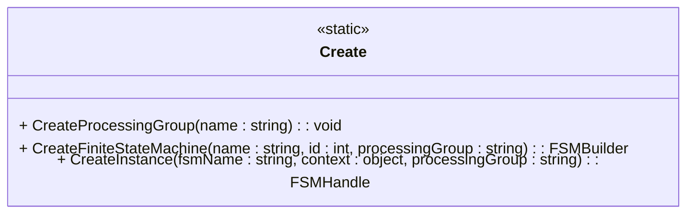

## Methods:

[Create Processing Group Method](./CreateProcessGroup/CreateProcessGroup.md)

[Create Finite State Machine Method](./CreateFiniteStateMachine/CreateFiniteStateMachine.md)

[Create Instance Method](./CreateInstance/CreateInstance.md)