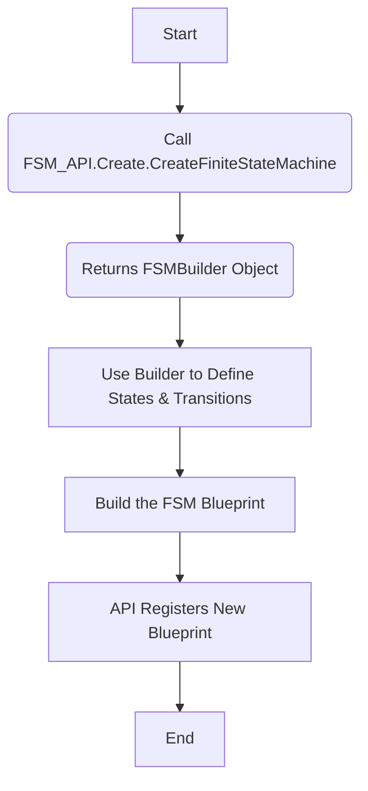

### CreateFiniteStateMachine Method Documentation

The `CreateFiniteStateMachine` method is a key part of the `FSM_API`'s `Create` module. Its purpose is to create a new **Finite State Machine (FSM) blueprint**—a conceptual definition of an FSM's states and transitions, not a live instance. It acts as a controlled entry point to the **FSMBuilder**, which is then used to define the FSM's behavior.

-----

### Method Signature

```csharp
public static FSMBuilder CreateFiniteStateMachine(string fsmName, int processRate, string processGroup)
```

**Parameters:**

  * **`fsmName`**: A unique string identifier for the new FSM blueprint.
  * **`processRate`**: An integer that defines how frequently the FSM instances associated with this blueprint should be updated. The values have specific meanings:
      * **-1**: The FSM instance will update every time its processing group is "ticked" or updated. This provides the highest frequency of updates.
      * **0**: The FSM is purely event-driven. It will **never** be updated by the system's tick loop and will only process transitions in response to a direct event being sent to it.
      * **\> 0**: The FSM will skip that many processing group "ticks" before it is updated. For example, a value of 1 would mean it updates every other tick. This allows for performance optimization by reducing the update frequency for less critical FSMs.
  * **`processGroup`**: The name of the `ProcessingGroup` this FSM will belong to.

**Returns:**

  * **`FSMBuilder`**: A fluent builder object used to define the states, transitions, and initial state of the FSM.

-----

### Purpose and Philosophy

This method simplifies the creation of new FSMs by providing a consistent, API-managed pathway. While it is technically possible to manually instantiate an `FSMBuilder` directly, using `CreateFiniteStateMachine` is the recommended and standard approach. This ensures that all FSMs are correctly registered with the `FSM_API`'s internal systems, guaranteeing proper management and avoiding potential inconsistencies or errors in a distributed system. It's a best practice for API consumption.

#### Conceptual Flow: A Flowchart

The flowchart below illustrates the conceptual path a developer should follow when creating an FSM blueprint. It highlights the role of `CreateFiniteStateMachine` as the official starting point.



This diagram makes it clear that the `FSMBuilder` is part of a larger, API-driven process, reinforcing the idea of using the provided method as the official entry point.

-----

### Usage Example: A Code Snippet

```csharp
// Step 1: Create a Processing Group (if not already done)
FSM_API.Create.CreateProcessingGroup("PlayerSession");

// Step 2: Use the API to get an FSMBuilder object
FSMBuilder myGameFSM = FSM_API.Create.CreateFiniteStateMachine(
    "GameStateManager",
    10, // Process 10 times per second
    "PlayerSession"
);

// Step 3: Use the builder to define the FSM's behavior
myGameFSM
    .AddState("MainMenu")
    .AddState("InGame")
    .AddTransition("MainMenu", "InGame", "StartGameEvent")
    .SetInitialState("MainMenu");

// The FSM blueprint is now ready to have instances created from it
```

The code snippet demonstrates a complete, end-to-end example, showing how the `CreateFiniteStateMachine` method fits into the overall FSM creation workflow.