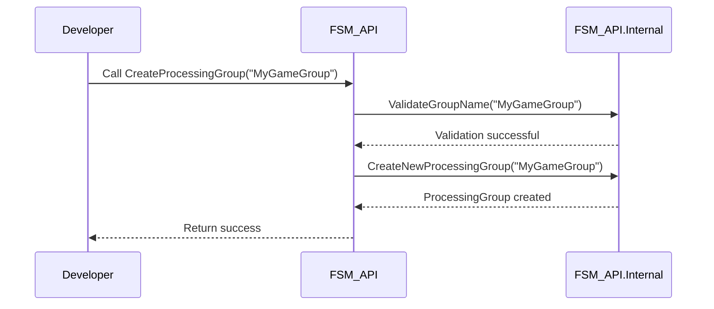
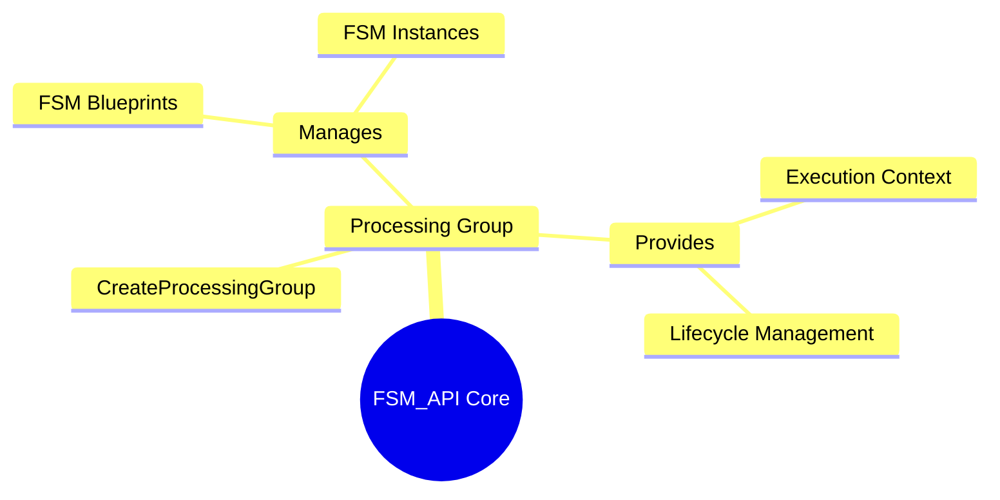

### CreateProcessingGroup Method Documentation

The `CreateProcessingGroup` method is a foundational utility in the `FSM_API` for managing and organizing groups of related finite state machines. Its primary purpose is to create a logical container that helps in the structured execution and lifecycle management of FSM instances.

-----

### Method Signature

```csharp
public static void CreateProcessingGroup(string name)
```

**Parameters:**

  * **`name`**: A unique string identifier for the new processing group. This name is used to reference the group when creating new FSMs or instances.

-----

### Purpose and Context

The `FSM_API` is designed to be highly modular and distributed. A **processing group** acts as a namespace or a "virtual host" for a collection of FSMs and their instances. All instances within the same processing group share the same execution context and are managed together, which is crucial for complex, multi-layered applications like the MyVR digiverse. For example, all FSMs related to a single game mode or user session can be placed in one processing group to ensure they communicate and terminate together.

#### How It Works: A Sequence Diagram

The sequence diagram below illustrates the steps involved when a developer calls the `CreateProcessingGroup` method.



This diagram shows the high-level flow from a developer calling the public method to the internal logic that handles the creation and validation of the new group.

-----

### Relationship to Other Components: A Mindmap

The `CreateProcessingGroup` method is the entry point for creating the container that holds other API components. The mindmap below shows how the concept of a "Processing Group" relates to the other key components in the `FSM_API`.



This diagram highlights that the `Processing Group` is a central concept that "manages" FSM blueprints and instances and "provides" an execution context for them, tying the whole system together.

-----

### Usage Example: A Code Snippet

```csharp
// The CreateProcessingGroup method is called to establish a new group.
// All subsequent FSMs and instances for this session will use this group name.

string gameSessionName = "Player_123_Session";
FSM_API.Create.CreateProcessingGroup(gameSessionName);

// The `gameSessionName` variable can now be used when creating FSMs
// and instances to ensure they all belong to the same group.
```