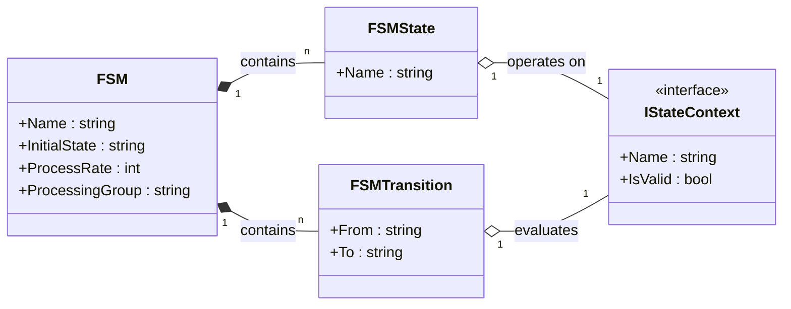
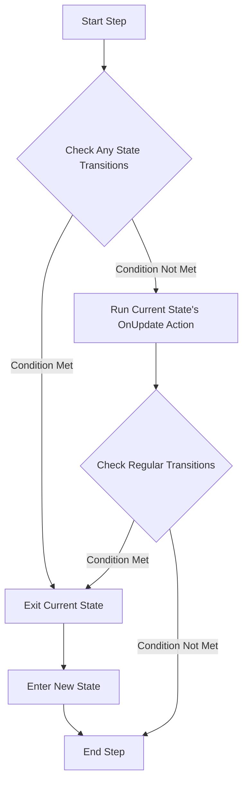
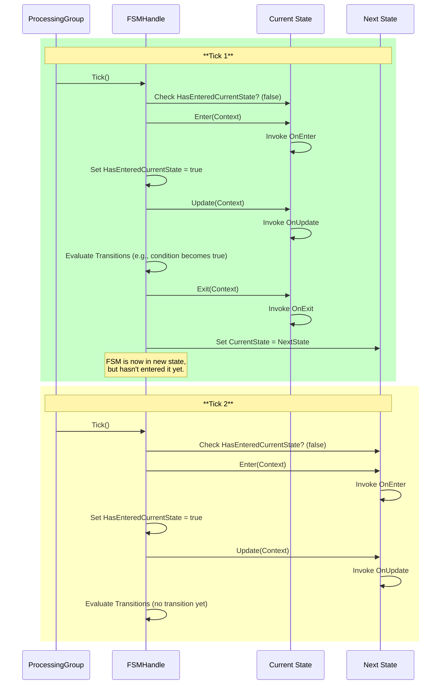

### `FSM` Class: The Master Blueprint

The `FSM` class is the central **blueprint** for a Finite State Machine. It's not a running instance, but rather a declarative definition of how a specific system or entity should behave. This blueprint is composed of **states** and the **transitions** that connect them. It provides a complete, reusable model that the `FSM_API` uses to create and manage running FSM **instances**.

-----

### Core Components and Relationships

The `FSM` class acts as a container and orchestrator for all the other components. Its primary responsibility is to hold a collection of `FSMState` and `FSMTransition` objects, along with key configuration properties like `InitialState`, `ProcessingGroup`, and `ProcessRate`.

#### UML Class Diagram

This UML diagram shows the `FSM` class and its relationships to `FSMState`, `FSMTransition`, and `IStateContext`. The composition relationship (solid diamond) indicates that an `FSM` object is composed of multiple states and transitions, which are essential to its function.

-----

### The `Step()` Method: The FSM Tick

The `Step()` method is the most critical part of the `FSM` class. It's the engine that drives a running FSM instance. It's called on every "tick" of the `ProcessingGroup` and is responsible for evaluating transitions and running the `OnUpdate` action of the current state. The order of operations in the `Step()` method is crucial for ensuring predictable FSM behavior.

#### The `Step()` Process: A Flowchart

This flowchart visualizes the decision-making process within a single execution of the `Step()` method. It highlights the priority given to **Any State transitions** and the subsequent execution of regular state-specific logic.

-----

### Key Concepts

#### Processing Groups

The `ProcessingGroup` property is a powerful tool for organizing FSM instances. It allows you to group related FSMs together and manage their collective update cycle. This is particularly useful in complex applications where you may want to control the tick rate of different parts of your system independently. For example, a `UI` processing group could update every frame, while a `BackgroundTask` group updates only every few seconds.

#### Process Rate

The `ProcessRate` property gives you fine-grained control over performance. By adjusting this value, you can conserve CPU cycles for non-critical FSMs.

  * **`-1`**: Updates every tick. Use this for time-critical behaviors like player movement.
  * **`0`**: Never updates automatically. Use this for purely event-driven FSMs that only respond to external events.
  * **`>0`**: Skips a number of ticks before updating. Use this for passive FSMs like background NPCs or object states that don't need continuous checks.

#### Any State Transitions

The `AnyStateIdentifier` (`"__ANY_STATE__"`) and `AddAnyStateTransition()` method provide a way to define global, high-priority rules. These transitions are checked before any other transitions, making them ideal for handling universal conditions such as:

  * A "death" state that can be entered from anywhere.
  * A "pause" state triggered by user input.
  * A global "error" state for system-wide failure.

-----

### Public Members

#### Properties

  * `public string Name { get; }`
  * `public string InitialState { get; }`
  * `public int ProcessRate { get; internal set; }`
  * `public string ProcessingGroup { get; internal set; }`

#### Methods

  * `public void AddState(FSMState s)`: Adds a state to the blueprint.
  * `public void AddTransition(string from, string to, Func<IStateContext, bool> cond)`: Adds a normal transition.
  * `public void AddAnyStateTransition(string to, Func<IStateContext, bool> cond)`: Adds an "Any State" transition.
  * `public void Step(string current, IStateContext ctx, out string next)`: The main update method for a single tick.
  * `public void ForceTransition(string from, string to, IStateContext ctx)`: Skips conditions and forces an immediate state change.

### Usage and Links

You won't typically instantiate the `FSM` class directly. Instead, you'll use the `FSMBuilder` to construct a new FSM blueprint and then interact with the `FSM_API` to get a running instance.

  * To learn how to define an FSM blueprint, see the documentation for `FSMBuilder`.
  * To understand how a single state works, refer to the documentation for `FSMState`.
  * For details on the rules that govern movement between states, see `FSMTransition`.

### The FSM Execution Flow

The design of the `FSM_API` enforces a clear, deterministic execution flow to ensure consistency and prevent race conditions. The `OnEnter`, `OnUpdate`, and `OnExit` actions are not called at the moment a state is set; instead, their execution is synchronized with the `ProcessingGroup`'s update cycle. This **decoupled execution** ensures that an FSM only ever has **one active state** at any given moment, simplifying debugging and logic.

#### Execution Sequence: A Sequence Diagram

The following sequence diagram illustrates the tick-based execution flow of a single `FSMHandle`. It shows how a state is entered and updated, and how a transition out of that state is handled over two consecutive process group ticks.

**Key Takeaways from the Diagram:**

  * **Delayed `OnEnter`:** An `OnEnter` action is never called on the same tick that its previous state's `OnExit` action is called. This delay ensures a clean separation between states.
  * **One-to-One Execution:** At any given point in time, only one `OnEnter`, `OnUpdate`, or `OnExit` action can be active for a single FSM instance. This prevents simultaneous state logic from running.
  * **Stateful `FSMHandle`:** The `FSMHandle` itself is responsible for tracking whether its current state has been entered, as indicated by the `HasEnteredCurrentState` flag.