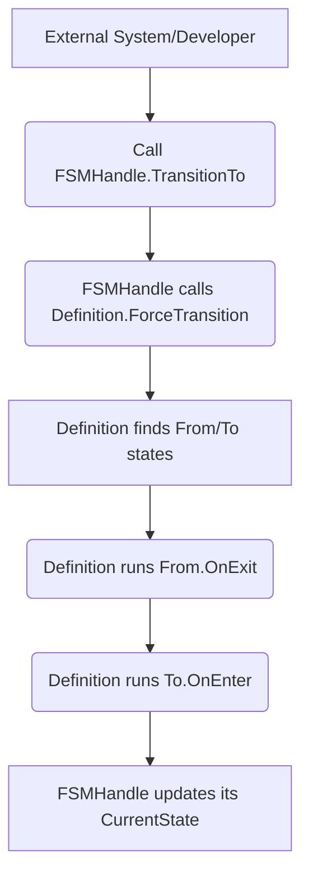

### `FSMHandle` Class: The FSM's Remote Control

The `FSMHandle` is your direct link to a live, running Finite State Machine instance. It acts as a **controller** that provides safe and managed access to the FSM's core components: the blueprint, the current state, and the instance-specific data. It abstracts away the complex internal workings of the FSM system, giving you a clean and intuitive way to manage an FSM's lifecycle.

-----

### Core Purpose

The `FSMHandle` is designed to be the single point of interaction for external systems. Rather than directly manipulating the FSM's internal state machine or data model, you use the handle to send commands, query the FSM's status, and access its context. This design is crucial for promoting the **decoupling** philosophy of the FSM\_API. It ensures that your application logic doesn't become tightly coupled to the FSM's implementation details.

#### The `FSMHandle`'s Role: A Flowchart

This flowchart illustrates the handle's role in the FSM's execution, showing how it receives a command from the outside world and uses its internal references to update the FSM's state and data.

-----

### Key Members

#### Public Properties

  * `public string CurrentState { get; internal set; }`: This is a fundamental property for designers and developers. It provides a simple way to check the FSM's current state without needing to understand its internal workings. For example, `if (playerHandle.CurrentState == "Idle")`.
  * `public IStateContext Context { get; set; }`: This property provides access to the FSM's data. While you can directly manipulate this data, the documentation correctly advises against this practice. It's generally safer to let the FSM's state actions (`OnEnter`, `OnUpdate`, `OnExit`) modify the context.
  * `public bool IsValid { get; }`: A crucial property for managing the FSM's lifecycle. The `FSM_API`'s internal systems will automatically stop processing a handle if this property becomes `false`.

#### Public Methods

  * `public void TransitionTo(string nextStateName)`: This method provides an escape hatch for situations where you need to override the FSM's logic and immediately force a state change. It's a powerful tool for handling events like a "game over" or a character's death.
  * `public void ResetFSMInstance()`: A utility method that resets the FSM to its `InitialState`, which is useful for situations like restarting a level or a game session.
  * `public void EvaluateConditions()`: This method is a manual trigger for event-driven FSMs. Instead of relying on a regular update loop, you can call this method whenever an external event occurs that might cause a state transition.
  * `public void Update(string processGroup)`: This is the method that drives the FSM's execution forward by one tick. The documentation correctly warns against calling this directly, as it's typically managed by the `FSM_API`'s internal scheduler.

-----

### Lifecycle Management

The `FSMHandle` is also responsible for managing its own lifecycle. The `DestroyHandle()` method ensures that the `OnExit` action of the current state is called and that the handle's `IStateContext` is marked as invalid. This is an essential step to ensure that the FSM is properly cleaned up and that resources are freed.
