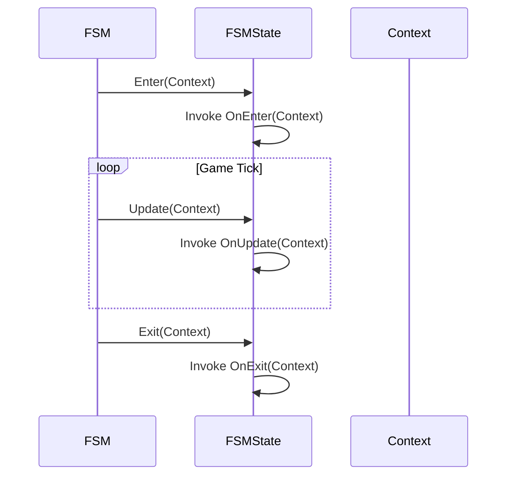

### `FSMState` Class: The Building Block of Behavior

The `FSMState` class represents a single, self-contained **state** in your Finite State Machine (FSM) blueprint. This class encapsulates a specific behavior or condition an object can be in, such as "Standing," "Jumping," or "Attacking." Each `FSMState` is defined by its unique name and a set of three optional actions that dictate what happens when an FSM instance is in that state.

-----

### Core Principles

An `FSMState` is a stateless container for actions. It doesn't hold data; instead, it operates on a provided `IStateContext` object. This design pattern ensures that the behavior defined in a state is completely decoupled from the specific data it's manipulating, making your FSM blueprints reusable across different data types.

#### Actions & Lifecycle

The lifecycle of an `FSMState` is governed by three distinct actions. The `FSM_API` calls these actions automatically as an FSM transitions between states and updates its current state.

  * **`OnEnter`**: This action is called exactly once, the moment the FSM enters this state. It's perfect for one-time initialization tasks, like playing a sound effect or resetting a timer.
  * **`OnUpdate`**: This action is called repeatedly as long as the FSM remains in this state. It's used for continuous behaviors, such as movement logic, checking for input, or playing a looping animation.
  * **`OnExit`**: This action is called exactly once, just before the FSM leaves this state. It's ideal for cleanup tasks, like stopping a sound or a running animation.

#### State Lifecycle: A Sequence Diagram

The following sequence diagram illustrates the order in which these actions are invoked during a typical FSM state lifecycle.



This diagram clarifies the sequential and recurring nature of the state's actions.

-----

### Class Members

#### Public Properties

  * `public string Name { get; }`
      * The unique, unchanging name of this state.

#### Public Methods

  * `public void SetOnEnter(Action<IStateContext> enter)`: Sets the `OnEnter` action.
  * `public void SetOnUpdate(Action<IStateContext> update)`: Sets the `OnUpdate` action.
  * `public void SetOnExit(Action<IStateContext> exit)`: Sets the `OnExit` action.

-----

### Usage Example: Creating and Defining a State

While the `FSMBuilder` is the preferred way to create states, this example shows how an `FSMState` object is instantiated directly.

```csharp
// Define the actions for the state
Action<IStateContext> enterAction = (context) => 
{
    Console.WriteLine($"Entering state {context.Name}");
};

Action<IStateContext> updateAction = (context) =>
{
    Console.WriteLine($"Updating in state {context.Name}...");
};

Action<IStateContext> exitAction = (context) =>
{
    Console.WriteLine($"Exiting state {context.Name}");
};

// Create a new FSMState instance
FSMState myNewState = new FSMState(
    "LoadingScreen",
    enterAction,
    updateAction,
    exitAction
);
```

This code demonstrates the direct construction of an `FSMState` object, assigning the three core actions at initialization. It's a low-level example of what the `FSMBuilder` handles internally.