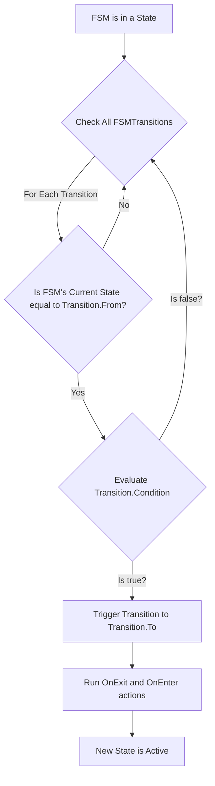

### `FSMTransition` Class: The Rule of Movement

The `FSMTransition` class is the **rulebook** that governs movement between states in your FSM blueprint. It defines a single, directional pathway from a starting state to an ending state, based on a specific condition. This class is crucial for mapping out the entire flow of an FSM's behavior.

-----

### Core Principles

An `FSMTransition` is a stateless object that encapsulates a single transition rule. It is defined by its `From` state, its `To` state, and a **`Condition`**—a function that returns a boolean value (`true` or `false`). The FSM system evaluates this `Condition` at every update cycle. If the `Condition` evaluates to `true`, the transition is triggered, and the FSM moves from the `From` state to the `To` state.

This approach promotes clean, declarative logic. Instead of hard-coding `if/then` statements within states, you simply define the rules for all possible transitions and let the `FSM_API` handle the evaluation.

#### Transition Flow: A Flowchart

The flowchart below illustrates the logic that the FSM system follows when checking for a transition.



This diagram makes it clear that the `FSMTransition` is evaluated in a sequential manner, with the `Condition` being the final gatekeeper for movement.

-----

### Class Members

#### Public Properties

  * `public string From { get; }`: The name of the starting state.
  * `public string To { get; }`: The name of the ending state.
  * `public Func<IStateContext, bool> Condition { get; }`: The function that must return `true` for the transition to occur. It operates on an `IStateContext` object.

-----

### Usage Example: Defining a Simple Transition

While the `FSMBuilder` simplifies this process, this example shows how an `FSMTransition` is manually created.

```csharp
// Define a boolean flag in your context to control the transition
public class MyGameContext : IStateContext 
{
    public string Name { get; set; }
    public bool IsValid { get; set; } = true;
    public bool HasPlayerReachedGoal { get; set; } = false;
}

// 1. Create the condition for the transition
// The condition function receives an IStateContext and returns a boolean
Func<IStateContext, bool> transitionCondition = (context) =>
{
    // We cast the generic context back to our specific type
    if (context is MyGameContext gameContext)
    {
        // The condition is true if the player has reached the goal
        return gameContext.HasPlayerReachedGoal;
    }
    return false;
};

// 2. Create the transition rule itself
FSMTransition gameCompletedTransition = new FSMTransition(
    from: "Playing",
    to: "GameOver",
    condition: transitionCondition
);

// This transition can now be added to an FSM blueprint
```

This example clarifies how the `FSMTransition` class is used to create a rule that moves the FSM from a "Playing" state to a "GameOver" state once a specific condition (`HasPlayerReachedGoal`) is met.