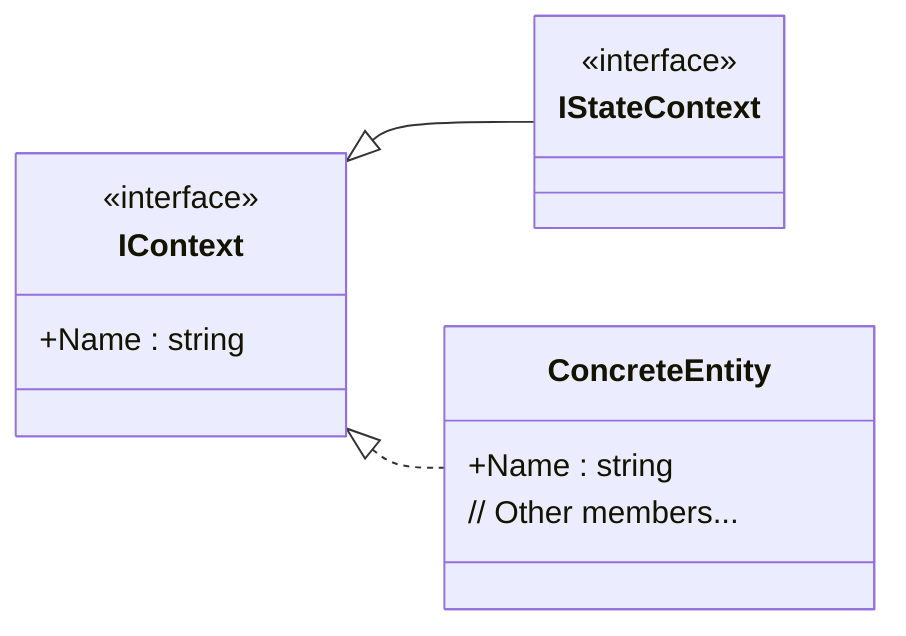

### The `IContext` Interface: Core Identification

Your `IContext` interface is a foundational building block in the `FSM_API` designed for one primary purpose: providing a **consistent naming convention** for all objects that need to be identified and managed by your system. It's a key part of your API's robust architecture, ensuring clarity and traceability.

#### Why `IContext` Exists

Unlike a typical context interface that holds application-specific data, your `IContext` is a much more general-purpose interface. Its main purpose is to enforce that any object implementing it must have a `Name` property. This simple contract allows your systems (like FSMs, diagnostic tools, and logging services) to identify and reference entities by a unique string, regardless of their underlying type. This design promotes a highly decoupled and modular system where components are easily tracked and managed.

`IContext` is the base for other, more specialized interfaces within your API, such as `IStateContext`, which builds upon the foundation of a simple name to add state-specific functionality.

#### UML Class Diagram

This UML class diagram illustrates the interface's structure and how it acts as a base for other specialized components.



  * `IContext` is the base interface, shown with the `<<interface>>` stereotype.
  * `IStateContext` inherits from `IContext`, indicated by the `IContext <|-- IStateContext` relationship. This shows that any `IStateContext` is also an `IContext`, and thus must have a `Name`.
  * A `ConcreteEntity` (a hypothetical class in your system) implements `IContext`, shown by the `IContext <|.. ConcreteEntity` relationship, confirming that it must provide the `Name` property.

#### Code Example and Usage

The following C\# code demonstrates how a simple class would implement your `IContext` and how it could be used for logging or identification.

```csharp
// An example of a class that implements IContext
public class MyManagedObject : IContext
{
    public string Name { get; set; }

    public MyManagedObject(string name)
    {
        Name = name;
    }

    public void DoSomething()
    {
        // Example of using the Name property for logging or debugging
        Console.WriteLine($"Processing object with name: {Name}");
    }
}

// A system that manages a list of IContext objects
public class ContextManager
{
    private List<IContext> _managedEntities = new List<IContext>();

    public void AddContext(IContext context)
    {
        _managedEntities.Add(context);
        Console.WriteLine($"Added '{context.Name}' to the manager.");
    }
}
```