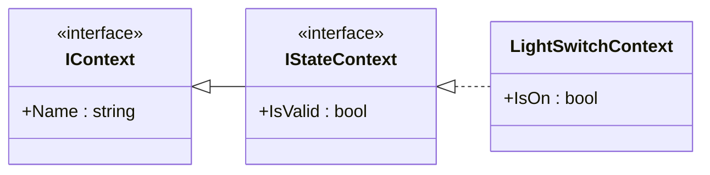
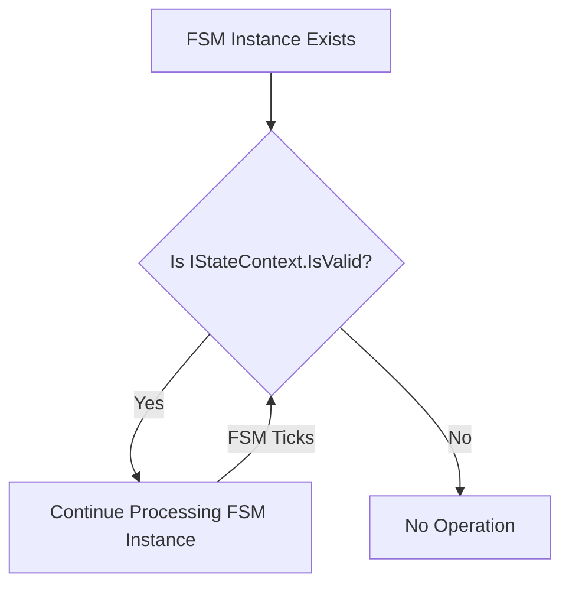

### `IStateContext` Interface: The State-Driven Data Model

The `IStateContext` interface is the heart of the FSM's data model. It represents the "thing" or object whose behavior is being managed by a finite state machine. By inheriting from `IContext`, it builds upon the foundational concept of a unique name and adds the crucial `IsValid` property, which directly controls the FSM's lifecycle.

-----

### Purpose and Philosophy

`IStateContext` enforces a clear separation between your FSM's logic and your application's data. It ensures that any object you want to put under FSM control has a common set of characteristics: a unique name for identification and a flag (`IsValid`) to signal its active status. This design is paramount for preventing the FSM system from processing instances tied to objects that have been destroyed or are no longer relevant, such as a player who has left a game or a document that has been closed.

### UML Class Diagram

This UML class diagram illustrates the inheritance relationship between `IStateContext` and its parent interface, `IContext`. It also shows how a concrete class, such as a `LightSwitch`, would implement `IStateContext` to integrate with the FSM system.



  * `IContext` provides the `Name` property.
  * `IStateContext` inherits from `IContext` (`<|--`), adding its own `IsValid` property.
  * `LightSwitchContext` implements `IStateContext` (`<|..`), meaning it must provide both a `Name` and an `IsValid` property. It can also contain other data relevant to the light switch, like `IsOn`.

-----

### The `IsValid` Property: Lifecycle Management

The `IsValid` property is a powerful mechanism for automatic lifecycle management. The FSM system continuously checks this property on every tick. If it evaluates to `false`, the FSM instance is automatically unregistered and disposed of, preventing errors and conserving system resources.

#### Lifecycle Flow: A Flowchart

The flowchart below demonstrates how the `IsValid` property governs the lifecycle of an FSM instance.



This diagram makes it clear that the `IsValid` check is a continuous loop that ensures the FSM only runs as long as its associated data is active.

-----

### Usage Example

The following code demonstrates a simple C\# class that could represent the data for a Light Switch and how it would implement `IStateContext`.

```csharp
/// <summary>
/// A concrete implementation of IStateContext for a simple light switch.
/// </summary>
public class LightSwitchContext : IStateContext
{
    public string Name { get; set; }
    public bool IsValid { get; set; } = true; // Assumes it starts as valid

    /// <summary>
    /// The state of the light switch (on or off).
    /// </summary>
    public bool IsOn { get; set; }

    public LightSwitchContext(string name)
    {
        Name = name;
    }
}

// In your application code
LightSwitchContext switchContext = new LightSwitchContext("KitchenLightSwitch");

// An FSM would be created and bound to this context.
// The FSM system will continuously check `switchContext.IsValid`.

// At some point, the light switch is physically removed or disposed of:
// switchContext.IsValid = false;

// The FSM system will now automatically unregister the FSM instance tied to this context,
// preventing it from being processed further.
```