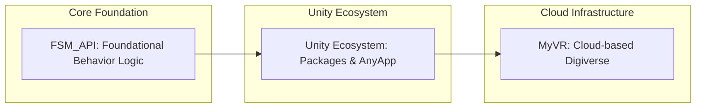

## MyVR: An Architecture for Decoupled and Distributed Experiences

```mermaid
graph LR
    subgraph Core Foundation
        FSM_API[FSM_API: Foundational Behavior Logic]
    end

    subgraph Unity Ecosystem
        UnityEcosystem[Unity Ecosystem: Packages & AnyApp]
    end

    subgraph Cloud Infrastructure
        MyVR[MyVR: Cloud-based Digiverse]
    end
 
    FSM_API --> UnityEcosystem
    UnityEcosystem --> MyVR

    click FSM_API "./FSM_API/FSM_API.md" "Go to FSM_API Documentation"
    click UnityEcosystem "./UnityEcosystem/UnityEcosystem.md" "Go to Unity Ecosystem Documentation"
    click MyVR "./MyVR/MyVR.md" "Go to MyVR Documentation"
```

