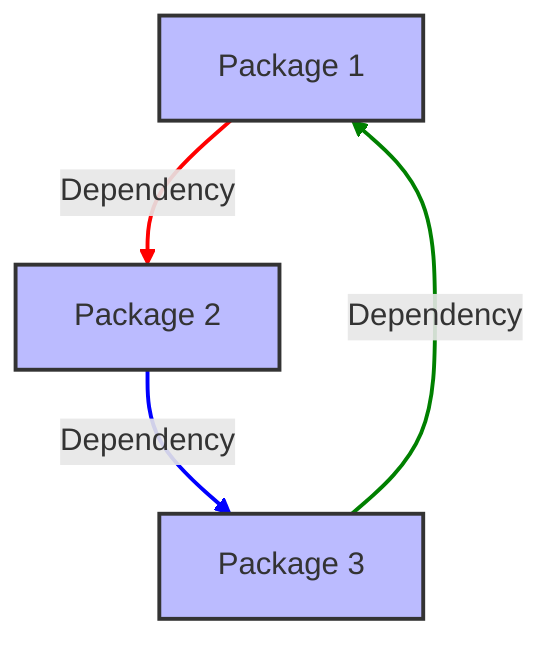

### Unity Ecosystem: Packages & AnyApp

The **Unity Ecosystem** is a collection of packages and applications designed to work seamlessly with the MyVR architecture. It provides developers with the tools and resources needed to create immersive and interactive experiences within the Unity environment.

#### Key Features

- **Modular Packages**: The ecosystem is built around modular packages that can be easily integrated into any Unity project, promoting reuse and reducing development time.
- **AnyApp Compatibility**: The Unity Ecosystem is designed to work with AnyApp, allowing developers to create cross-platform experiences that can be deployed on a variety of devices and environments.
- **Rich Asset Library**: Developers have access to a rich library of assets, including 3D models, animations, and audio files, to enhance their applications.

#### Technical Details

- **Package Management**: The Unity Ecosystem leverages Unity's package management system, making it easy to install, update, and manage dependencies.
- **API Integration**: The ecosystem provides a set of APIs for interacting with the FSM_API and other components of the MyVR architecture.
- **Performance Optimization**: The Unity Ecosystem includes tools and best practices for optimizing performance and ensuring smooth interactions within applications.

#### Example Diagram

