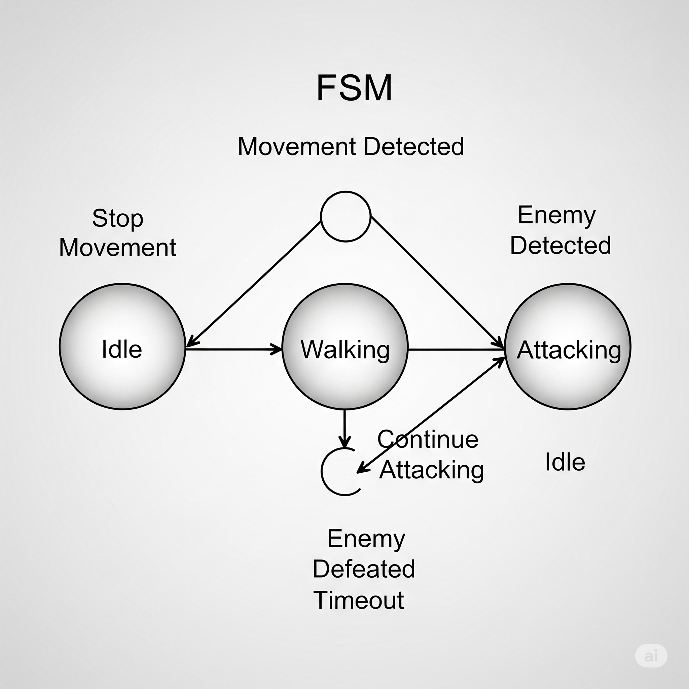
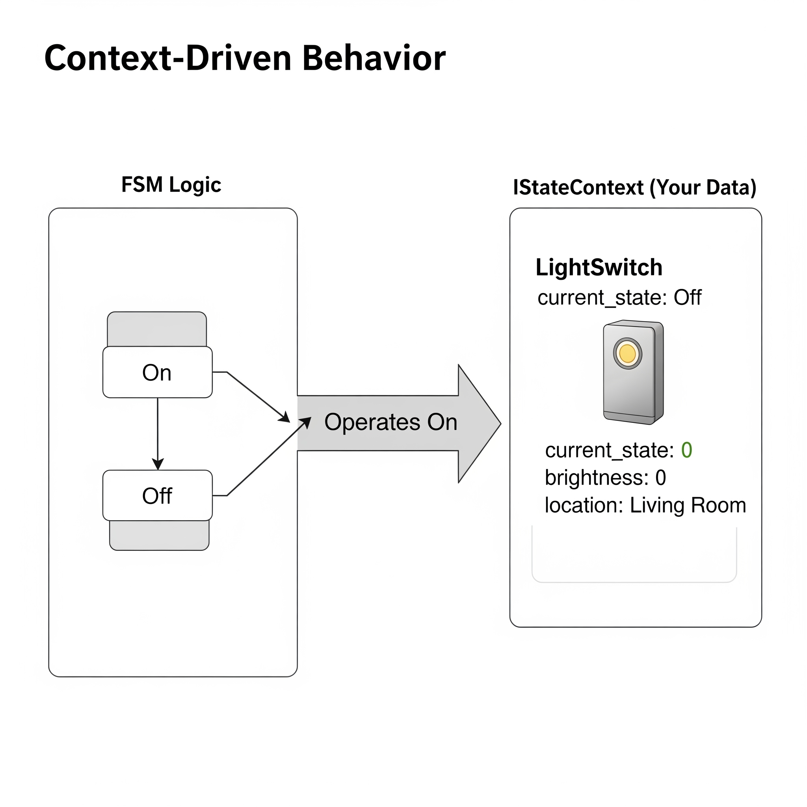
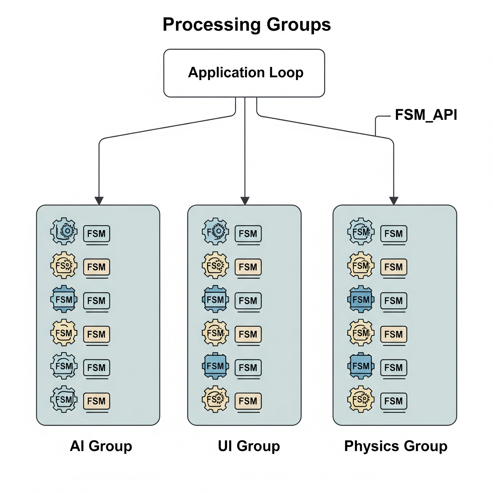
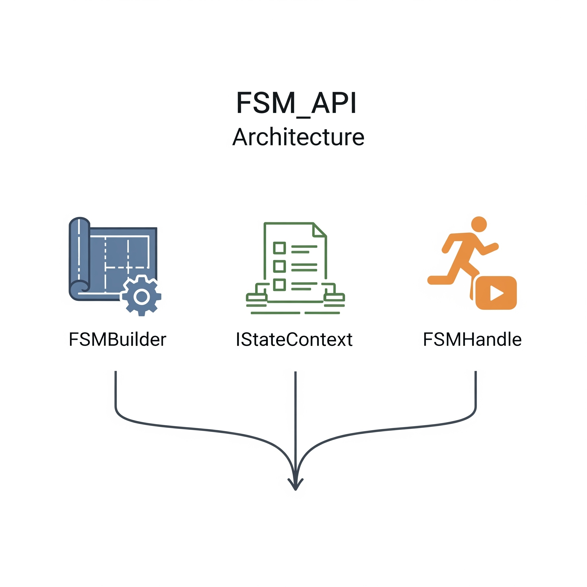

# FSM_API: The Singularity Workshop's Finite State Machine API

A high-performance, modular, and engine-agnostic C#/.NET library for building and managing Finite State Machines (FSMs). The FSM_API empowers developers to model complex behavior with clarity and efficiency—whether you're handling AI, player states, UI flow, or reactive systems.

While a dedicated package for Unity is available, the core API is pure C# and designed to be portable and independent of any game engine.

This package provides a unified logic architecture, allowing you to design all application logic through a central, fluent FSM definition system.

🎮 What Is a Finite State Machine (FSM)?

Think of an FSM as a system that can only be in one "state" at a time. It has a limited, or "finite," number of possible states (like Idle, Walking, or Attacking) and clear rules for "transitions" (moving from one state to another). FSMs simplify intricate behaviors into modular, testable logic units, replacing tangled if/else trees with structured and readable logic.


<a href="Visuals/FSM.png" target="_blank">
    
</a>
*A visual representation of a Finite State Machine (FSM).*
<br><br>

# ✨ Why FSM_API?

* **Unified Logic Architecture:** Design all application logic through a central, fluent FSM definition system that is easy to read and manage.
<br>
<a href="Visuals/UnifiedLogicArchitecture.png" target="_blank">
    
</a>
*Unified Logic Architecture.*
<br>
<br>
* **Engine-Agnostic:** Built in pure C#/.NET with no dependencies on any game engine. The core API is portable and can be integrated into any C# application, including games, simulations, and backend services.
<br>
<a href="Visuals/EngineAgnostic.png" target="_blank">
    
</a>
*Engine-Agnostic.*
<br>
<br>
* **Context-Driven Execution:** FSMs operate on your custom data structures through the IStateContext interface, ensuring a direct and efficient link between your state logic and your application's data.
<br>
<a href="Visuals/ContextDrivenExecution.png" target="_blank">
    
</a>
*A diagram showing how generic FSM logic operates on specific user data (IStateContext).*
<br>
<br>
* **Flexible Update Control:** Attach FSMs to any update loop or scheduler, or define custom update groups for fine-tuned performance. (Unity integration is available as a separate package.)
<br>
<a href="Visuals/ProcessingGroups.png" target="_blank">
    
</a>
*A diagram showing how FSMs can be organized into different update groups.*
<br>
<br>
* **Performance-Driven:** Designed for efficiency and responsiveness, allowing you to manage hundreds or thousands of active state machines without performance issues.
<br>
<a href="Visuals/FSM_API.png" target="_blank">
    
</a>
*A diagram showing the FSM_API's core components.*
<br>
<br>


## 📦 Installation

The recommended way to install FSM_API is via NuGet. Alternatively, you can clone the repository for manual integration.

### Install via NuGet

```sh
dotnet add package TheSingularityWorkshop.FSM_API
```

Or using the NuGet Package Manager in Visual Studio:

```sh
Install-Package TheSingularityWorkshop.FSM_API
```

### Manual Installation (Clone)

Clone the repository and add the source or DLL to your project:

```sh
git clone https://github.com/TrentBest/FSM_API
```

<br>

# 🚀 Getting Started

This ReadMe provides a high-level overview. For a deeper dive, please consult the following documents:

* [01. Core Concepts: Your Guide to FSM_API](User%20Guide/01_Core_Concepts.md) — A detailed explanation of FSM definitions, instances, states, and contexts.
* [03. Getting Started with C# (Non-Unity)](User%20Guide/03_Getting_Started_CSharp.md) — Instructions for using the FSM_API in any pure C# application.
* [11. Frequently Asked Questions (FAQ)](User%20Guide/11_FAQ.md) — Answers to common questions about the API.

Unity integration is available as a separate package:
* [Unity Integration Guide](https://github.com/TrentBest/FSM_API_Unity) — The official Unity repository for integrating FSM_API into your Unity project.


<br>

# 🔗 Structure & Portability

    ✅ No engine dependencies in core API
    ✅ Works in any .NET C# app
    ✅ Designed for integration into games, simulations, VR, robotics, backend services, or any C# environment where state machines are needed
    ✅ Unity integration available as a separate package


<a href="https://www.patreon.com/TheSingularityWorkshop" target="_blank">
    
</a>