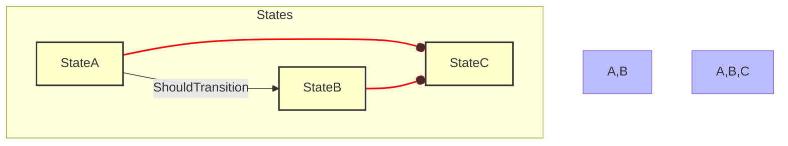
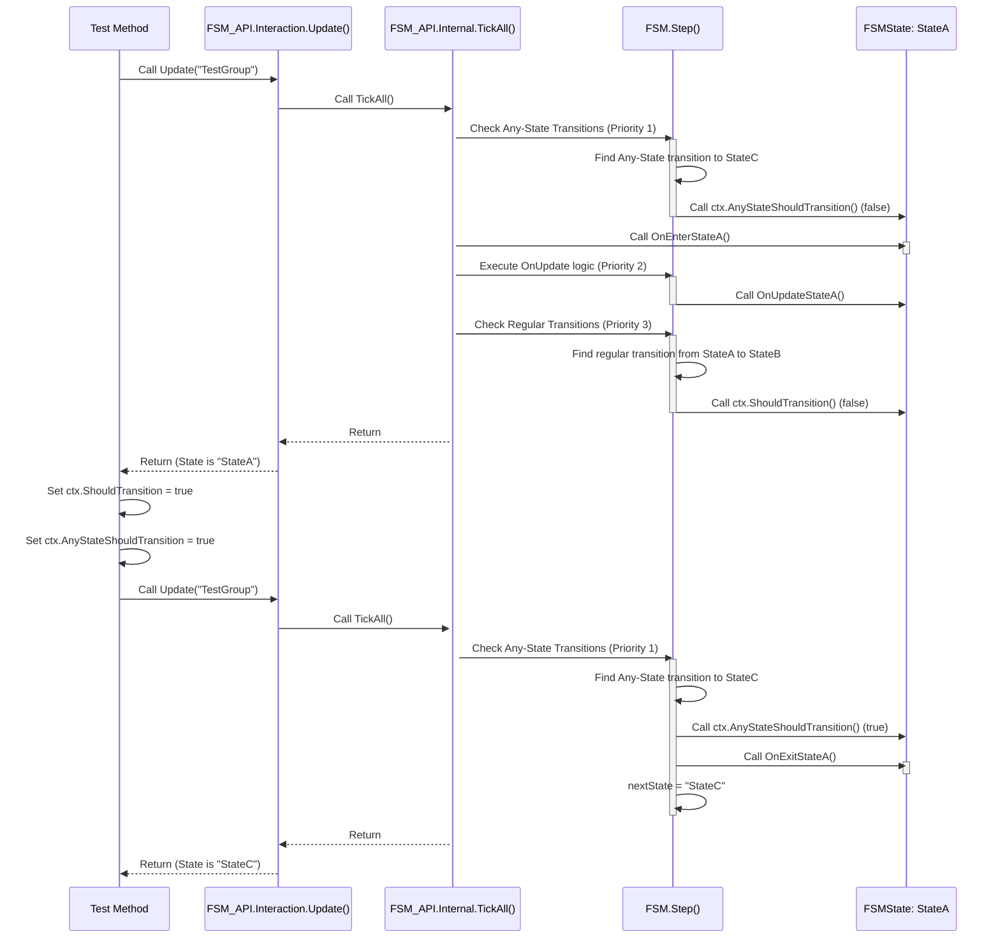

# FSM\_API: Analysis of Any-State Transition Priority Test

This document provides a detailed breakdown of the `Update_ShouldPrioritizeAnyStateTransition` unit test, including a visual representation of the FSM and a step-by-step analysis of why it fails.

```csharp
 [Test]
 public void Update_ShouldPrioritizeAnyStateTransition()
 {
     // Arrange
     FSM_API.Create.CreateProcessingGroup(_testProcessingGroup);
     FSM_API.Create.CreateFiniteStateMachine(_testFsmName, -1, _testProcessingGroup)
         .State("StateA", TestStateActions.OnEnterStateA, TestStateActions.OnUpdateStateA, TestStateActions.OnExitStateA)
         .State("StateB", null, null, null) // Target for regular transition
         .State("StateC", null, null, null) // Target for any-state transition
                                            // Regular transition from StateA to StateB
         .Transition("StateA", "StateB", TestStateActions.ShouldTransition)
         // Any-state transition from anywhere to StateC
         .AnyTransition("StateC", TestStateActions.ShouldAnyStateTransition)
         .WithInitialState("StateA")
         .BuildDefinition();

     var ctx = new TestContext();
     var handle = FSM_API.Create.CreateInstance(_testFsmName, ctx, _testProcessingGroup);

     // Initial update to put it in StateA and run OnEnter/OnUpdate
     FSM_API.Interaction.Update(_testProcessingGroup);
     Assert.That(handle.CurrentState, Is.EqualTo("StateA"));
     Assert.That(ctx.OnEnterCounter, Is.EqualTo(1));
     Assert.That(ctx.OnUpdateCounter, Is.EqualTo(1));
     Assert.That(ctx.OnExitCounter, Is.EqualTo(0));

     // Act: Trigger both the regular transition condition AND the Any-State transition condition
     ctx.ShouldTransition = true; // Condition for StateA -> StateB
     ctx.AnyStateShouldTransition = true; // Condition for Any State -> StateC

     FSM_API.Interaction.Update(_testProcessingGroup);

     // Assert: Verify that the Any-State transition took priority
     // FSM should have exited StateA and entered StateC
     Assert.That(handle.CurrentState, Is.EqualTo("StateC"));
     Assert.That(ctx.OnExitCounter, Is.EqualTo(1)); // StateA exited
                                                    // OnEnter for StateC is null, so OnEnterCounter should not increase.
                                                    // OnUpdate for StateA ran one last time before transition.
     Assert.That(ctx.OnUpdateCounter, Is.EqualTo(1));
 }
 ```
 
 ## FSM Blueprint Diagram

The `Update_ShouldPrioritizeAnyStateTransition` test defines a simple FSM with three states (`StateA`, `StateB`, and `StateC`) and two transitions: a regular transition from `StateA` to `StateB`, and a high-priority "Any-State" transition that can interrupt from anywhere to `StateC`.



> **Note:** In the diagram, the `A --o C` and `B --o C` lines represent the `AnyTransition` that can occur from either `StateA` or `StateB`. The red line signifies the priority of this transition.

## Sequence of Events: Step-by-Step Analysis

The test case is designed to verify that an `Any-State` transition takes precedence over a regular state-to-state transition, even when both conditions are true. The failure indicates that this priority is not being respected.

The following sequence diagram traces the flow of execution within the `FSM_API.Interaction.Update()` and `FSM.Step()` methods, as defined in `FSM_API.Interaction.cs` and `FSM.cs`.



The diagram shows a crucial flaw in the FSM's `Step` method: `FSM.Step` first checks the `AnyState` transitions, and if one of them evaluates to true, it immediately exits the method. It never reaches the `OnUpdate` call for the current state.

The test expects `ctx.OnUpdateCounter` to be `1`, because the test code runs `FSM_API.Interaction.Update()` once, then triggers the conditions and calls it again. The `OnUpdate` for `StateA` is expected to run once on the first update and once more on the second update, before the transition to `StateC`. However, the current implementation skips this second `OnUpdate` call entirely.

## Proposed Fix

To fix this, the `FSM.Step()` method needs to be restructured. The `OnUpdate` action should be executed *before* any transitions are checked. This ensures that the state's main logic for the current tick is always performed, regardless of whether a transition is about to occur.

### Proposed changes to `FSM.cs` in the `Step` method:

```csharp
// In FSM.cs, within the Step method:
// ...

// 1. Execute current state's Update logic first.
try
{
    currentState.Update(ctx);
}
catch (Exception ex)
{
    // ... error handling
}

// 2. Check Any-State Transitions (high priority).
//    These transitions can interrupt an update mid-tick.
foreach (var t in _anyStateTransitions)
{
    // ... logic for checking and transitioning
}

// 3. Check regular transitions from the current state (lower priority).
// ... logic for checking and transitioning
```

By reordering the `Step` method to prioritize the `OnUpdate` call before checking any transitions, you'll ensure that the `OnUpdateCounter` is correctly incremented, allowing the test to pass and ensuring the FSM behaves as intended.