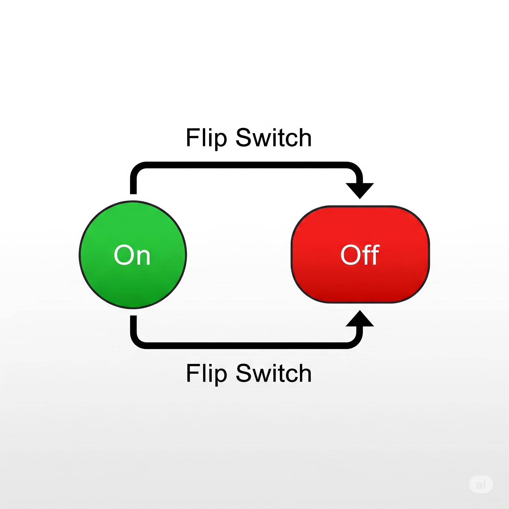
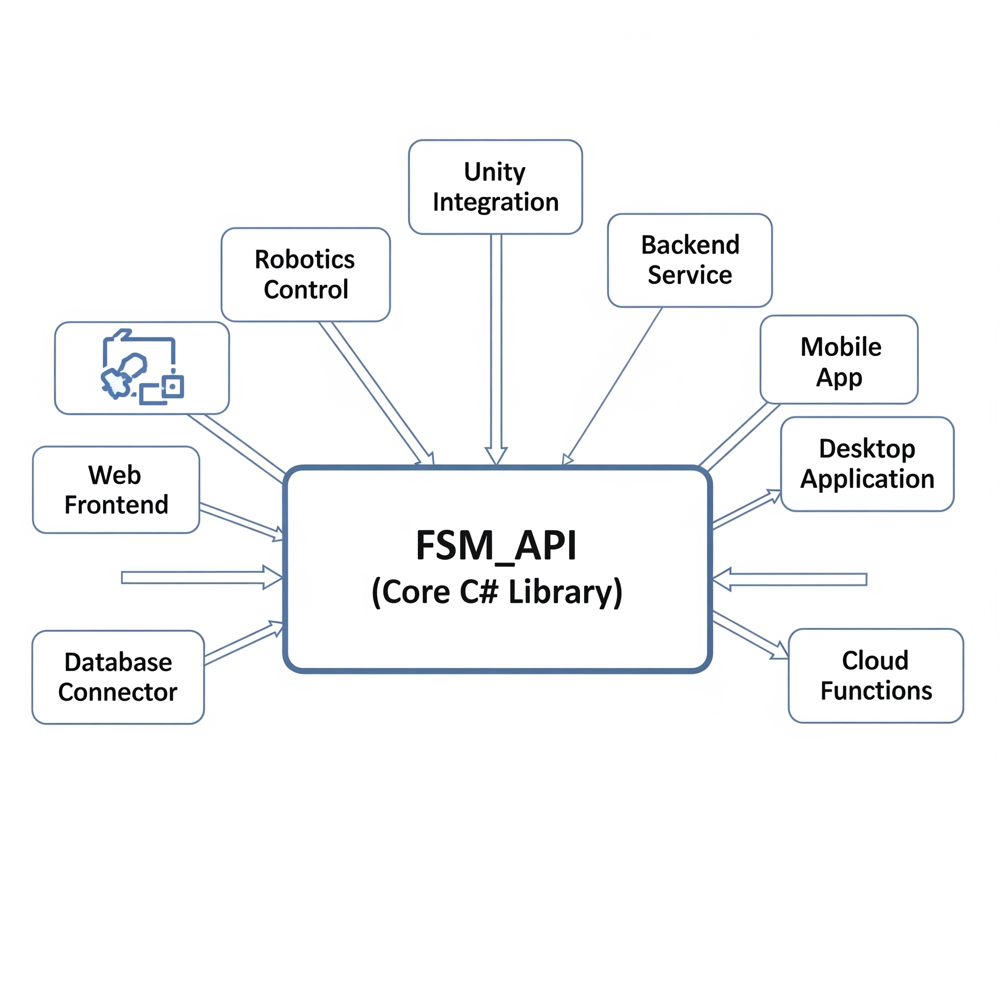
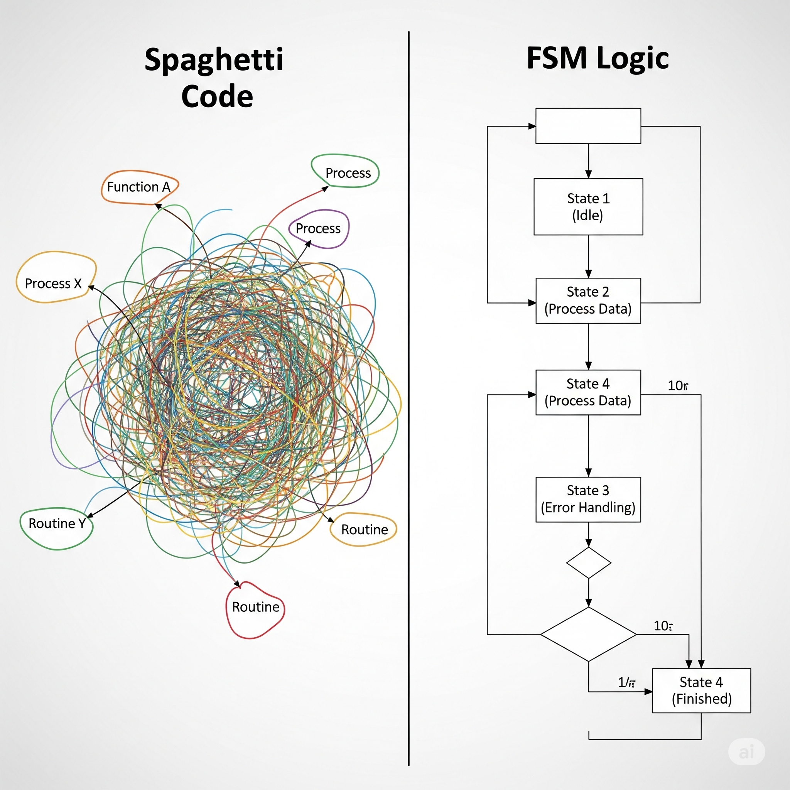
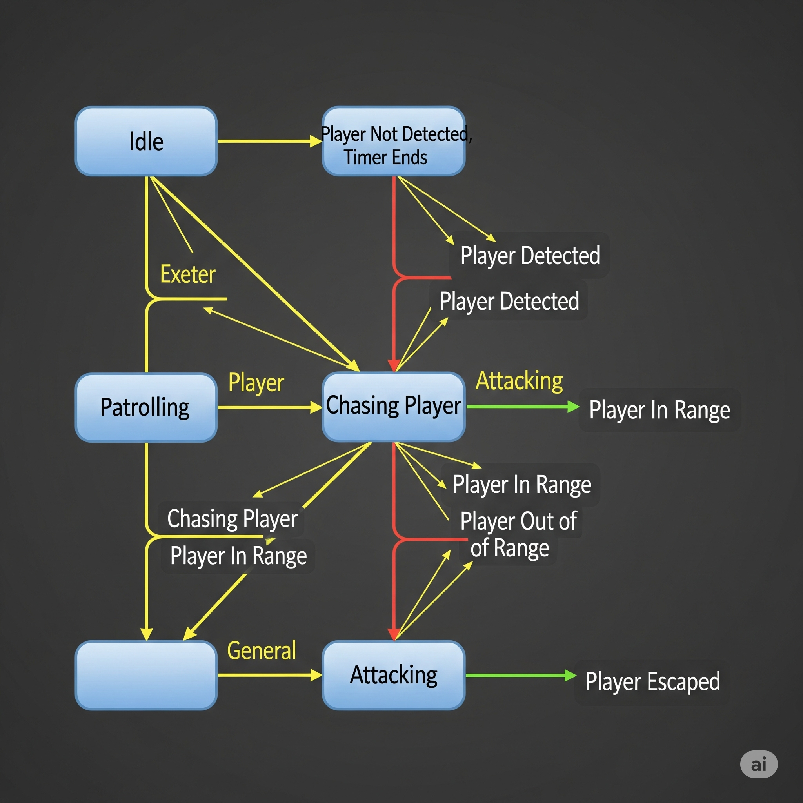
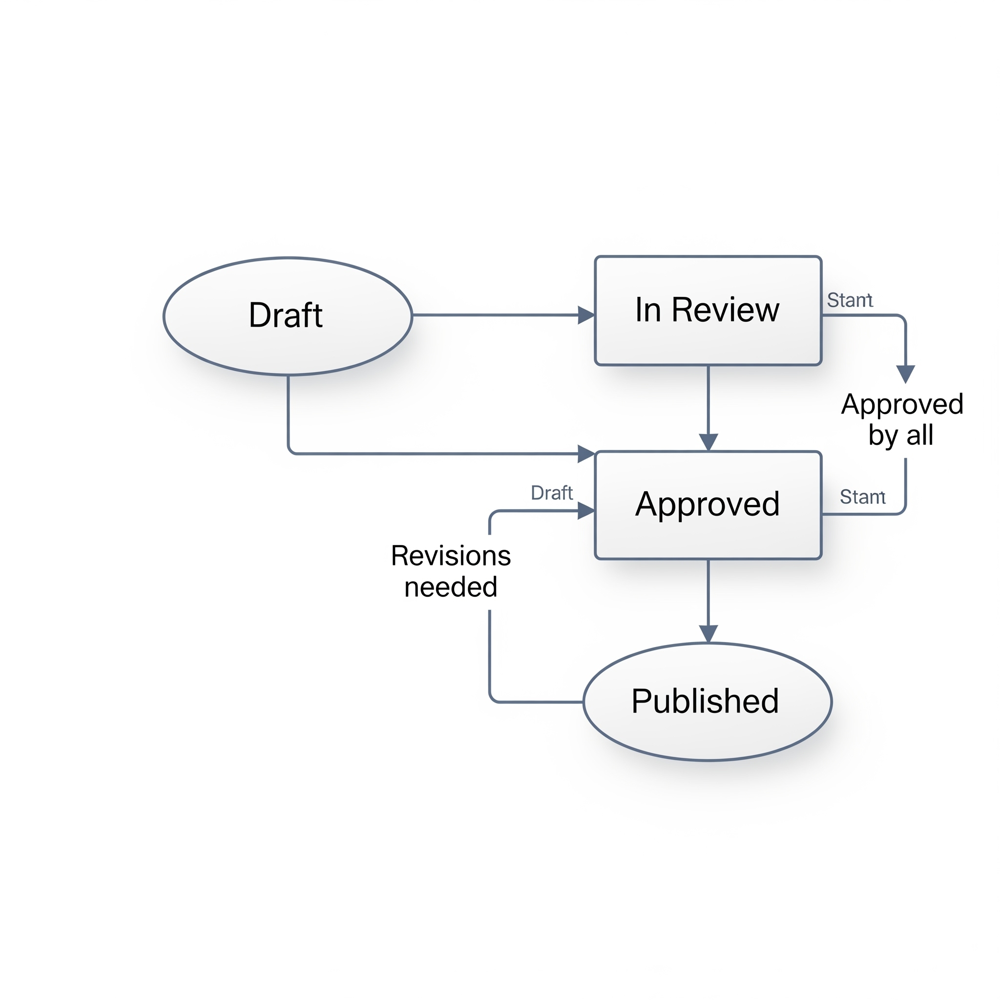

# 00. Introduction to FSM_API

## 📚 Table of Contents

[00. Introduction to FSM_API](User%20Guide/00_Introduction.md)

[01. Core Concepts: Your Guide to FSM_API](User%20Guide/01_Core_Concepts.md)

[03. Getting Started with C# (Non-Unity)](User%20Guide/03_Getting_Started_CSharp.md)

[04. FSMBuilder Deep Dive: Building Your FSMs](User%20Guide/04_FSM_Builder_Deep_Dive.md)

[05. Understanding and Implementing Your Context (IStateContext)](User%20Guide/05_Context_Implementation.md)

[06. FSMModifier Deep Dive: Modifying Your FSMs at Runtime](User%20Guide/06_FSM_Modifier_Deep_Dive.md)

[07. Robust Error Handling: Cascading Degradation System](User%20Guide/07_Error_Handling.md)

[08. Performance Tips & Best Practices](User%20Guide/08_Performance_Tips.md)

[09. Common Use Cases & Examples](User%20Guide/09_Common_Use_Cases.md)

[10. FSM_API for Non-Coders: A Big Picture Overview](User%20Guide/10_Non_Coder_Overview.md)

[11. Frequently Asked Questions (FAQ)](User%20Guide/11_FAQ.md)

---

## 👋 Welcome to FSM_API!

FSM_API is a powerful, performance-driven library designed to help you easily manage complex behaviors in your applications and games using **Finite State Machines (FSMs)**. It provides a robust and flexible framework for defining, managing, and executing state-based logic.

<em>At its core, an FSM is a simple concept we see every day. A light switch has two states, 'On' and 'Off', and a clear action, 'flipping the switch', causes a transition between them.</em>

---

## 🎮 What is the UnityIntegration?

> **Note:** This FSM_API project is a pure C# library and is completely engine-agnostic. It does not include any Unity-specific code or dependencies.

Unity integration is available as a separate package, which provides the necessary bridge for using FSM_API within Unity projects. If you are looking to use FSM_API in Unity, please see:

**[FSM_API_Unity GitHub Repository](https://github.com/TrentBest/FSM_API_Unity)**

All Unity-specific documentation and examples are maintained in that repository. This documentation focuses on the core, engine-agnostic FSM_API.

*A diagram showing the Core API connecting to various integrations.*

---

## 🎯 Why and Where Can You Use FSM_API?

FSM_API can be used anywhere you need structured, predictable, and maintainable state-driven logic. Its applications span numerous domains:

    Application & System Logic: Manage complex workflows like a document moving from Draft to Review to Published. Control UI states, such as enabling or disabling form elements based on user progress. Build robust data processing pipelines or manage the lifecycle of network connections.

    AI & Agent Behavior: Define the logic for any autonomous entity, whether it's an enemy in a game (Patrolling, Chasing, Attacking) or a robot in a warehouse (Charging, Fetching Item, Returning to Base).

    Interactive Systems: Control the states of any interactive object, such as a door (Open, Closed, Locked) or a vending machine (Idle, Awaiting Selection, Dispensing).

Its benefits include:
* **Performance-Driven:** Designed for **efficiency** and **responsiveness**, even when managing **hundreds or thousands** of active state machines.
* **Clarity & Maintainability:** Designed for **readability and elegance**, FSM_API helps teams collaborate with ease and maintain codebases confidently.

<em>Transform tangled logic into a clear, manageable flow.</em>
* **Testability:** FSM_API’s clean **separation of logic and context** makes it easy to write **automated unit tests** for your state machines.

*A concrete example of an FSM for character AI.*

<em>An FSM for enemy AI in a game.</em>

<em>An FSM for a document workflow in a business application.</em>

---

## 📚 Where to Go Next?

To best navigate this documentation, please consider your current understanding:

* **New to Finite State Machines (FSMs)?**
    If terms like "states," "transitions," "event-driven," or "stepped" are new to you, begin with our **Theory folder** for comprehensive explanations and definitions:
    * **[Theory/01_What_is_an_FSM.md](Theory/01_What_is_an_FSM.md)**
    * **[Theory/02_States_and_Transitions.md](Theory/02_States_and_Transitions.md)**
    * **[Theory/03_Stepped_vs_Event_Driven.md](Theory/03_Stepped_vs_Event_Driven.md)**
    * **[Theory/04_Advanced_FSM_Concepts.md](Theory/04_Advanced_FSM_Concepts.md)** (if applicable)

* **Familiar with FSMs, but new to FSM_API?**
    For an abridged overview of how FSM_API implements core FSM concepts, proceed to the **[01. Core Concepts: Your Guide to FSM_API](01_Core_Concepts.md)** section.

* **Ready to start coding?**
    Jump straight into our C# guide: **[02. Getting Started with c#](/User%20Guide/03_Getting_Started_CSharp.md)**.

* **Are you a non-coder looking for a high-level understanding?**
    Get a broad overview of what FSM_API does and its benefits without diving into code in **[10. FSM_API for Non-Coders: A Big Picture Overview](10_Non_Coder_Overview.md)**.

---

[Continue to: 01. Core Concepts: Your Guide to FSM_API](01_Core_Concepts.md)

**Support the project:** [**Donate via PayPal**](https://www.paypal.com/donate/?hosted_button_id=3Z7263LCQMV9J)