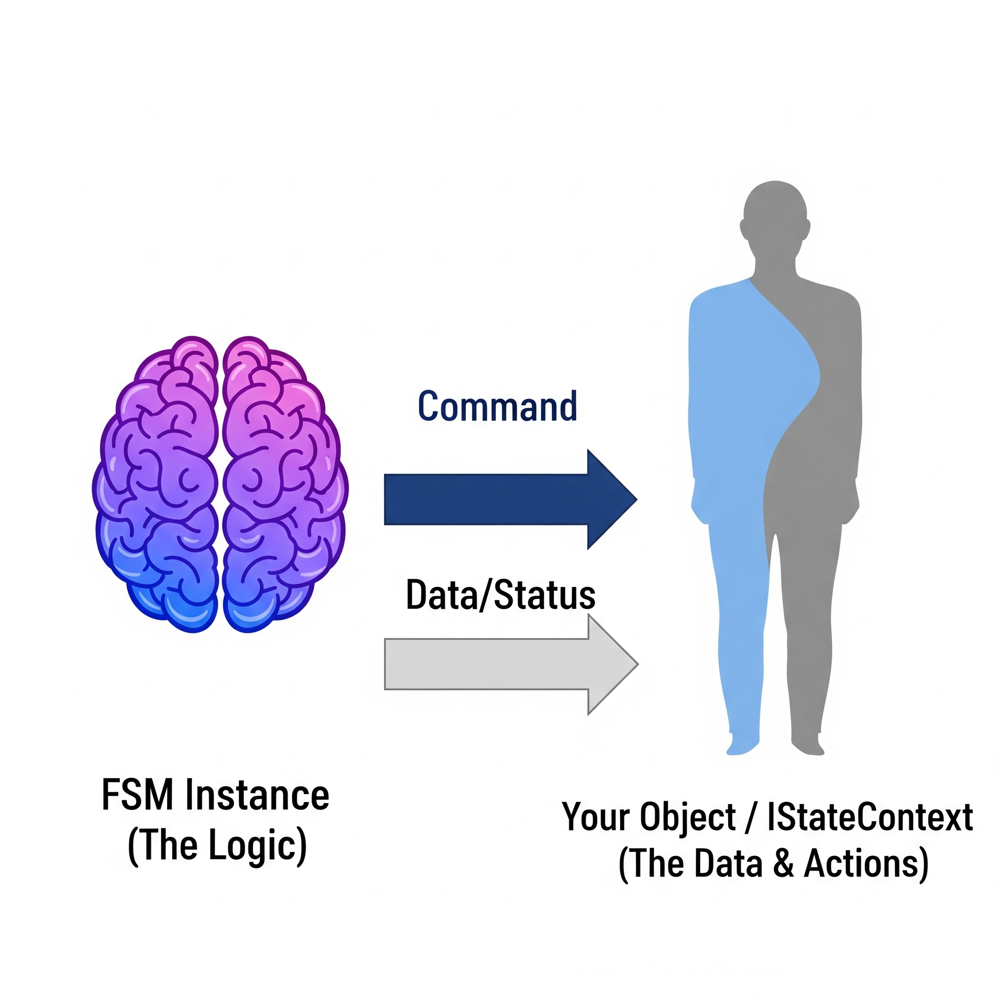

# 01. Core Concepts: Your Guide to FSM_API

## 📚 Table of Contents

[00. Introduction to FSM_API](00_Introduction.md)

[01. Core Concepts: Your Guide to FSM_API](01_Core_Concepts.md)

[02. Getting Started with Unity](02_Getting_Started_Unity.md)

[03. Getting Started with C# (Non-Unity)](03_Getting_Started_CSharp.md)

[04. FSMBuilder Deep Dive: Building Your FSMs](04_FSM_Builder_Deep_Dive.md)

[05. Understanding and Implementing Your Context (IStateContext)](05_Context_Implementation.md)

[06. FSMModifier Deep Dive: Modifying Your FSMs at Runtime](06_FSM_Modifier_Deep_Dive.md)

[07. Robust Error Handling: Cascading Degradation System](07_Error_Handling.md)

[08. Performance Tips & Best Practices](08_Performance_Tips.md)

[09. Common Use Cases & Examples](09_Common_Use_Cases.md)

[10. FSM_API for Non-Coders: A Big Picture Overview](10_Non_Coder_Overview.md)

[11. Frequently Asked Questions (FAQ)](11_FAQ.md)

---

## 🔁 FSMs Refreshed: A Quick Look

For those already familiar with the concept, a **Finite State Machine (FSM)** is a behavioral model that ensures an entity exists in one of a finite number of "states" at any given time, transitioning between them based on defined rules or "events." It's a powerful pattern for organizing complex logic where behavior changes predictably based on current conditions.

* **Example**: A character in a game moving from an `Idle` state to a `Walking` state, or a UI button transitioning from `Enabled` to `Pressed`.

If you need a more in-depth theoretical understanding of FSMs, including states, transitions, and different FSM paradigms, please refer to our **[Theory folder](Theory/01_What_is_an_FSM.md)**.

---

## ✨ Understanding FSM_API's Core Components

Now, let's look at how FSM_API implements the fundamental concepts of FSMs. Each component below plays a distinct role in an FSM's structure and operation within this library.

---

### 🧬 FSM Definition: The Blueprint

Think of an **FSM Definition** as the complete plan or blueprint for how a certain behavior should work.

* **What it is:** This blueprint lays out all the "stages" your character, item, or game logic can be in (like "Walking," "Sleeping," or "Door Open"). It also defines the rules for moving between these stages and what actions happen in each stage.
* **Why it matters:** Once you have this blueprint, you can use it many times! For example, you can design a "Basic Enemy Behavior" blueprint once, then use that same plan to control hundreds of different enemies. Each acts on its own, but they all follow the same underlying design, saving you from repeating work.

    Similarly, you could design a "Document Workflow" blueprint for a content management system, then use that same plan to manage the approval process for hundreds of documents. Each document follows the same workflow stages (e.g., Draft, Review, Approved, Archived), but operates independently.


<a href="Visuals/Definition_vs_Instance.png" target="_blank">
    
</a>

---

### ⚙️ FSM Instance: The Live Version

If an FSM Definition is the blueprint, an **FSM Instance** is the actual, live "thing" that's running in your game or application. It's a specific character actually walking, a specific door actually opening, or specific game logic actually deciding what to do next.

* **What it is:** This is a live, active version of your FSM blueprint. It's always connected to a specific "thing" in your game (like a player character, a monster, or even a button).
* **Purpose:** The FSM Instance is your main way to observe and, if needed, directly influence one of these live FSMs. It tells you what state the FSM is currently in (e.g., "walking" or "awaiting approval").
* **Key Point:** Multiple FSM Instances can share the same FSM Definition but operate entirely independently. Each manages its own current stage and actions, even though they all follow the same initial blueprint.


---

### 🟢 State: The "What's Happening Now"

<a href="Visuals/State_Lifecycle.png" target="_blank">
    
</a>

A **State** is simply a named stage or phase that your FSM can be in. It's the "what's happening right now" for the thing your FSM is controlling.

* **What it is:** A single, distinct phase like "Idle," "Moving," "Attacking," "Door_Closed," or "UI_Enabled."
* **How you define its actions (what happens):** FSM_API makes this straightforward. You don't need to create separate "State" files or classes. Instead, when you use the `FSMBuilder` to create your FSM Definition, you directly tell it what code should run for each named state:
     * `onEnter`: This code runs **once** the moment the FSM enters this state. Perfect for starting an animation, playing a sound, or writing a log entry.
     * `onUpdate`: This code runs **repeatedly** as long as the FSM stays in this state. Good for things that happen over time, like moving a character, checking continuous input, or checking the status of a network connection.
     * `onExit`: This code runs **once** the moment the FSM leaves this state. Useful for stopping animations, cleaning up resources, triggering post-state actions, or sending a final status update.
* **Defining State Actions:** You provide these actions as small pieces of code (often called "lambdas" or "methods") directly when building your FSM.

```csharp
    // Imagine this is part of your FSM setup
    .State("Idle",
        onEnter: (context) => { /* Code to start Idle animation */ },
        onUpdate: (context) => { /* Code to check for player input */ },
        onExit: (context) => { /* Code to stop Idle animation */ })
````

*(Don't worry about `context` for now; we'll explain it next\!)*

-----

### 🤝 State Context (`IStateContext`): Your Data Connection

<a href="Visuals/FSM_Context_Relationship.png" target="_blank">
    
</a>

The **State Context** is simply *your* object – the actual thing in your game that the FSM is controlling. It's how the FSM can "talk" to your game's data and features.

  * **What it is:** This is your own class or script from your game (like a `PlayerController` script on your player character, or a `DoorManager` script on a door). The FSM needs this context to know what it's supposed to be influencing.

  * **Purpose:** The FSM itself is generic. It doesn't know about "player health" or "door position." It needs *your* context object to get that information. Your state actions (`onEnter`, `onUpdate`, `onExit`) will use this context to read data (e.g., "is the door open?") or make changes (e.g., "open the door").

  * **How you use it: Implementing the `IStateContext` Interface:** For your game object or script to be used as a context, it must follow a small "contract" by implementing the `IStateContext` interface. This interface ensures your object provides two key pieces of information that FSM\_API needs: its `Name` and whether it `IsValid`.

      * The `IStateContext` actually builds upon an even simpler contract, `IContext`, which just provides a `Name`. `IStateContext` then adds the `IsValid` check.

  * **Interface Details (What your object must provide):**

<!-- end list -->


```csharp
public interface IContext
{
    // Your object must provide a 'Name'. This helps debugging!
    string Name { get; set; }
}

public interface IStateContext : IContext // It inherits from IContext!
{
    // Your object must tell FSM_API if it's still valid.
    // For example, if a game character is destroyed, IsValid might become 'false'.
    bool IsValid { get; }
}
```

  * **Example of what your class looks like (you'll fill in your own game details):**

<!-- end list -->

```csharp
// This is an example of a standard C# class implementing IStateContext.
public class GameCharacter : IStateContext
{
    // --- Your application-specific data ---
    public float CurrentHealth { get; private set; }
    public bool IsAlive { get; private set; } = true;

    // --- IContext requires this ---
    // FSM_API uses this name for debugging.
    public string Name { get; set; }

    // --- IStateContext requires this ---
    // This tells FSM_API if the object is still active.
    // When IsAlive is false, the FSM instance can be cleaned up automatically.
    public bool IsValid => IsAlive;

    // Constructor for the character
    public GameCharacter(string name, float health)
    {
        this.Name = name;
        this.CurrentHealth = health;
    }

    // Your specific methods that states will call
    public void TakeDamage(float amount)
    {
        if (!IsAlive) return;
        CurrentHealth -= amount;
        if (CurrentHealth <= 0)
        {
            CurrentHealth = 0;
            IsAlive = false;
        }
    }

    public void PlayAnimation(string animName)
        {
            // In a game, this would trigger a visual animation.
            // In a non-graphical application, this could log a status change
            // or call another system to perform a task.
            System.Console.WriteLine($"[{Name}] Performing action: {animName}");
        }
}
```
-----

### For Unity Developers
For engine-specific examples and a dedicated getting started guide, please see the official Unity integration repository:
**[FSM_API_Unity on GitHub](https://github.com/TrentBest/FSM_API_Unity)**

-----

[Continue to: 03. Getting Started with C#](03_Getting_Started_CSharp.md)
