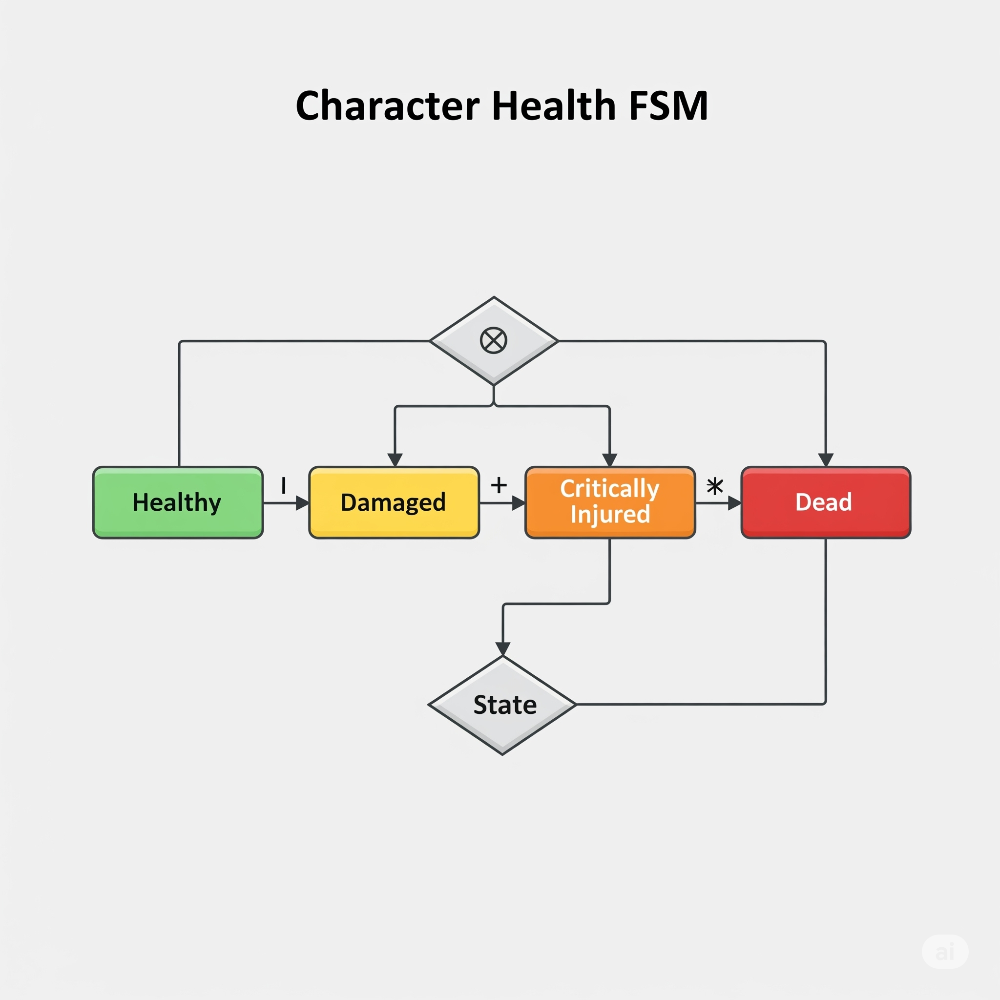
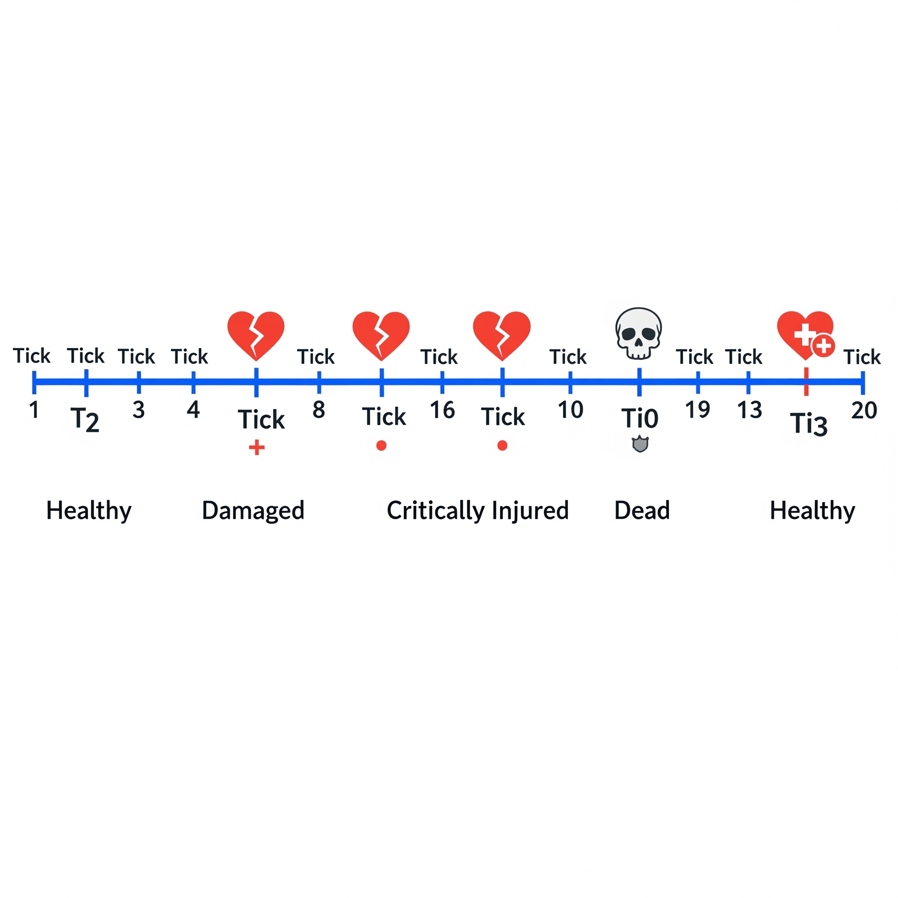

# 03\. Getting Started with FSM\_API in Pure C\#

> Use FSM\_API with pure C\# classes — completely decoupled from Unity — for backend logic, simulations, AI, networking, or any state-based system.

This guide shows how to use FSM\_API in non-Unity environments (console, services, backends, robotics, etc.) with clean, minimal dependencies.

-----

## 📚 Table of Contents

[00. Introduction to FSM_API](00_Introduction.md)

[01. Core Concepts: Your Guide to FSM_API](01_Core_Concepts.md)

[03. Getting Started with C# (Non-Unity)](03_Getting_Started_CSharp.md)

[04. FSMBuilder Deep Dive: Building Your FSMs](04_FSM_Builder_Deep_Dive.md)

[05. Understanding and Implementing Your Context (IStateContext)](05_Context_Implementation.md)

[06. FSMModifier Deep Dive: Modifying Your FSMs at Runtime](06_FSM_Modifier_Deep_Dive.md)

[07. Robust Error Handling: Cascading Degradation System](07_Error_Handling.md)

[08. Performance Tips & Best Practices](08_Performance_Tips.md)

[09. Common Use Cases & Examples](09_Common_Use_Cases.md)

[10. FSM_API for Non-Coders: A Big Picture Overview](10_Non_Coder_Overview.md)

[11. Frequently Asked Questions (FAQ)](11_FAQ.md)

-----

## 🎯 What This Example Will Demonstrate

We’ll simulate a basic character health lifecycle using FSM\_API — all in **pure C\#**. This example is useful for understanding how FSM\_API integrates into any standard C\# application, offering the same benefits as in Unity.

This example illustrates:

  * How to define and link FSMs to standard C\# classes as their context.
  * How a game character transitions through health-related states (`Healthy`, `Damaged`, `Critically Injured`, `Dead`).
  * How FSM\_API makes these transitions declarative, clean, and maintainable.
  * How to manually control the "ticking" of FSMs without relying on a game engine's built-in loop.
  * How FSMs can be revived and continue operating even after simulated "death."

### 💡 Simulation Flow

1.  The player starts in the **Healthy** state.
2.  Over several ticks, they take damage, triggering transitions to:
      * **Damaged**
      * **Critically Injured**
      * **Dead**
3.  After death, a revive command is issued.
4.  Health is restored.
5.  The FSM automatically transitions back to **Healthy**.

All output is printed to the console to simulate animation, audio, and event feedback — ideal for unit tests or backend game systems.

-----

## ✅ Step 1: Define Your Pure C\# Context

Create a standard C\# class to represent the "thing" your FSM will manage — like a character, connection, pipeline, or subsystem. This class will hold the data and methods that your FSM's states will interact with.

It must implement the `IStateContext` interface. Recall from the **[01. Core Concepts: Your Guide to FSM_API](01_Core_Concepts.md)** that `IStateContext` requires `Name` and `IsValid` properties.

### 🛠 Example: `GameCharacterContext.cs`

```csharp
using System;
using TheSingularityWorkshop.FSM_API;

public class GameCharacterContext : IStateContext
{
    private float _currentHealth = 100f;
    private int _currentAmmo = 10;
    private float _moveSpeed = 5f;
    private bool _isActive = true;
    private bool _isReviveCommandIssued = false;

    public float CurrentHealth => _currentHealth;
    public int CurrentAmmo => _currentAmmo;
    public float MoveSpeed => _moveSpeed;

    // IStateContext Properties
    public string Name { get; set; }
    public bool IsValid => _isActive; // FSM_API uses this to know if the context is still relevant

    public GameCharacterContext(string name)
    {
        Name = name;
        Console.WriteLine($"{Name} context created.");
    }

    // Methods that FSM states will call to interact with this context
    public void TakeDamage(float amount)
    {
        _currentHealth -= amount;
        Console.WriteLine($"{Name} took {amount} damage. Health: {CurrentHealth}");
    }

    public void SetActive(bool active)
    {
        _isActive = active;
        Console.WriteLine($"{Name} active status set to {_isActive}.");
    }

    public void RestoreHealth(float amount)
    {
        _currentHealth += amount;
        if (_currentHealth > 100f) _currentHealth = 100f;
        Console.WriteLine($"{Name} health restored to {CurrentHealth}.");
    }

    public void SimulateMovement()
    {
        Console.WriteLine($"{Name} is moving at speed {MoveSpeed}.");
    }

    public void PlaySound(string soundName)
    {
        Console.WriteLine($"{Name} playing sound: {soundName}");
    }

    // Methods for transition conditions
    public void IssueReviveCommand() => _isReviveCommandIssued = true;
    public void ClearReviveCommand() => _isReviveCommandIssued = false;
    public bool IsReviveCommandPending => _isReviveCommandIssued;
}
```

-----

## ✅ Step 2: Define and Create the FSM

With your context ready, you can now define your FSM using `FSM_API.CreateFiniteStateMachine()` and its fluent builder pattern. Then, create an instance of that FSM, linking it to your `GameCharacterContext`.

### 🎯 Example: `PureCSharpGameLoop.cs`

<a href="Visuals/Character_Health_FSM.png" target="_blank">
</a>
    
</a>
*A flowchart of the Character Health FSM showing states and transitions.*
</a>

This class will set up our FSM definition and manage the FSM instance within a simulated game loop.

```csharp
using System;
using TheSingularityWorkshop.FSM_API;

public class PureCSharpGameLoop
{
    private FSMHandle characterHealthFSM;
    private GameCharacterContext playerCharacter;

    public void SetupGame()
    {
        playerCharacter = new GameCharacterContext("Hero");

        // Define the FSM blueprint if it doesn't already exist.
        // The FSM definition is reusable across multiple instances.
        if (!FSM_API.Exists("CharacterHealthFSM"))
        {
            FSM_API.CreateFiniteStateMachine("CharacterHealthFSM", processRate: 1, processingGroup: "GameLogic")
                .State("Healthy",
                    onEnter: ctx => ((GameCharacterContext)ctx).PlaySound("HappyTune"),
                    onUpdate: ctx => 
                        Console.WriteLine($"{ctx.Name} is Healthy. Health: {((GameCharacterContext)ctx).CurrentHealth}"),
                    onExit: ctx => ((GameCharacterContext)ctx).PlaySound("SadTune"))
                .State("Damaged",
                    onEnter: ctx => ((GameCharacterContext)ctx).PlaySound("OuchSound"),
                    onUpdate: ctx => 
                        Console.WriteLine($"{ctx.Name} is Damaged. Health: {((GameCharacterContext)ctx).CurrentHealth}"))
                .State("CriticallyInjured",
                    onEnter: ctx => ((GameCharacterContext)ctx).PlaySound("WarningAlarm"),
                    onUpdate: ctx => Console.WriteLine($"{ctx.Name} is Critically Injured!"))
                .State("Dead",
                    onEnter: ctx => ((GameCharacterContext)ctx).PlaySound("DeathRattle"),
                    onUpdate: ctx => Console.WriteLine($"{ctx.Name} is Dead."),
                    onExit: ctx => ((GameCharacterContext)ctx).ClearReviveCommand())
                .WithInitialState("Healthy")
                .Transition("Healthy", "Damaged", ctx => 
                    ((GameCharacterContext)ctx).CurrentHealth <= 75 && ((GameCharacterContext)ctx).CurrentHealth > 25)
                .Transition("Damaged", "Healthy", ctx => 
                    ((GameCharacterContext)ctx).CurrentHealth > 75)
                .Transition("Damaged", "CriticallyInjured", ctx => 
                    ((GameCharacterContext)ctx).CurrentHealth <= 25 && ((GameCharacterContext)ctx).CurrentHealth > 0)
                .Transition("CriticallyInjured", "Damaged", ctx => 
                    ((GameCharacterContext)ctx).CurrentHealth > 25 && ((GameCharacterContext)ctx).CurrentHealth <= 75)
                .Transition("CriticallyInjured", "Dead", ctx => 
                    ((GameCharacterContext)ctx).CurrentHealth <= 0)
                .Transition("Dead", "Healthy", ctx => 
                    ((GameCharacterContext)ctx).IsReviveCommandPending && ((GameCharacterContext)ctx).CurrentHealth > 0)
                .BuildDefinition();
        }

        // Create a live FSM instance, associating it with our playerCharacter context.
        characterHealthFSM = FSM_API.CreateInstance("CharacterHealthFSM", playerCharacter);
        Console.WriteLine($"FSM for {playerCharacter.Name} initialized to state: {characterHealthFSM.CurrentState}");
    }

    // Call this method from your main application loop to update the FSMs
    public void UpdateGameLogic() => FSM_API.Update("GameLogic");

    // Helper methods for accessing character and FSM state
    public GameCharacterContext GetPlayerCharacter() => playerCharacter;
    public string GetCharacterFSMState() => characterHealthFSM.CurrentState;
}
```

-----

## ✅ Step 3: Manual Update Loop

Since you don’t have an engine's `Update()` or `FixedUpdate()` loop, you'll explicitly "tick" the FSMs yourself from your main application loop or a dedicated manager. You'll call `FSM_API.Update()` for the processing group you defined.

### 🕹 Example: `Program.cs` (Main Application Entry Point)

<a href="Visuals/Simulation_Timeline.png" target="_blank">
</a>
    
</a>
*A timeline of the 20-tick simulation showing key events and state changes.*
</a>

```csharp
using System;
using System.Threading; // For Thread.Sleep

public class Program
{
    public static void Main(string[] args)
    {
        Console.WriteLine("--- Starting Pure C# FSM Demo ---");

        var game = new PureCSharpGameLoop();
        game.SetupGame();
        var player = game.GetPlayerCharacter();

        for (int i = 0; i < 20; i++) // Simulate 20 game ticks
        {
            Console.WriteLine($"\n--- Tick {i + 1} ---");

            // Simulate events that affect the character's health
            if (i == 2) player.TakeDamage(30);   // Health: 100 -> 70 (Healthy -> Damaged)
            if (i == 5) player.TakeDamage(20);   // Health: 70 -> 50 (Still Damaged)
            if (i == 8) player.TakeDamage(30);   // Health: 50 -> 20 (Damaged -> Critically Injured)
            if (i == 10) player.TakeDamage(20);  // Health: 20 -> 0 (Critically Injured -> Dead)
            if (i == 12) player.IssueReviveCommand(); // Issue revive command
            if (i == 13) player.RestoreHealth(100);    // Restore health, FSM should transition Dead -> Healthy

            // Advance the FSMs in the "GameLogic" processing group
            game.UpdateGameLogic();

            Console.WriteLine($"Current FSM State: {game.GetCharacterFSMState()}");
            Thread.Sleep(500); // Optional: pause for half a second to observe output
        }

        Console.WriteLine("\n--- FSM Demo Finished ---");
    }
}
```

-----

## 🧪 Running the Example

To run this pure C\# FSM example:

1.  **Create a Console App Project** in your preferred IDE (e.g., Visual Studio, VS Code with C\# extension).
2.  **Add FSM\_API Reference:**
      * If FSM\_API is available on NuGet, add it via the NuGet Package Manager.
      * Otherwise, manually add a reference to the `TheSingularityWorkshop.FSM_API.dll` file.
3.  **Add Code Files:**
      * Create `GameCharacterContext.cs` and paste the code from Step 1.
      * Create `PureCSharpGameLoop.cs` and paste the code from Step 2.
      * Replace the content of `Program.cs` with the code from Step 3.
4.  **Run the App** and observe the FSM transitions and console output, which will show your character moving through different health states.

-----

## ✅ Summary

  * FSM\_API works seamlessly outside of Unity and other game engines, providing a powerful FSM solution for any pure C\# application.
  * You define your application's data models or entities as classes that implement the **`IStateContext`** interface.
  * FSM definition and instantiation logic remain consistent with Unity usage, using `FSM_API.CreateFiniteStateMachine()` and `FSM_API.CreateInstance()`.
  * You gain explicit control over when FSMs process their logic by calling `FSM_API.Update("YourGroupName")` from your application's main loop or scheduler.
  * This makes FSM\_API an ideal choice for server-side logic, complex simulations, AI systems, backend services, or custom game engines where you need robust and decoupled state management.

-----

[➡️ Continue to: 04. FSMBuilder Deep Dive: Building Your FSMs](04_FSM_Builder_Deep_Dive.md)