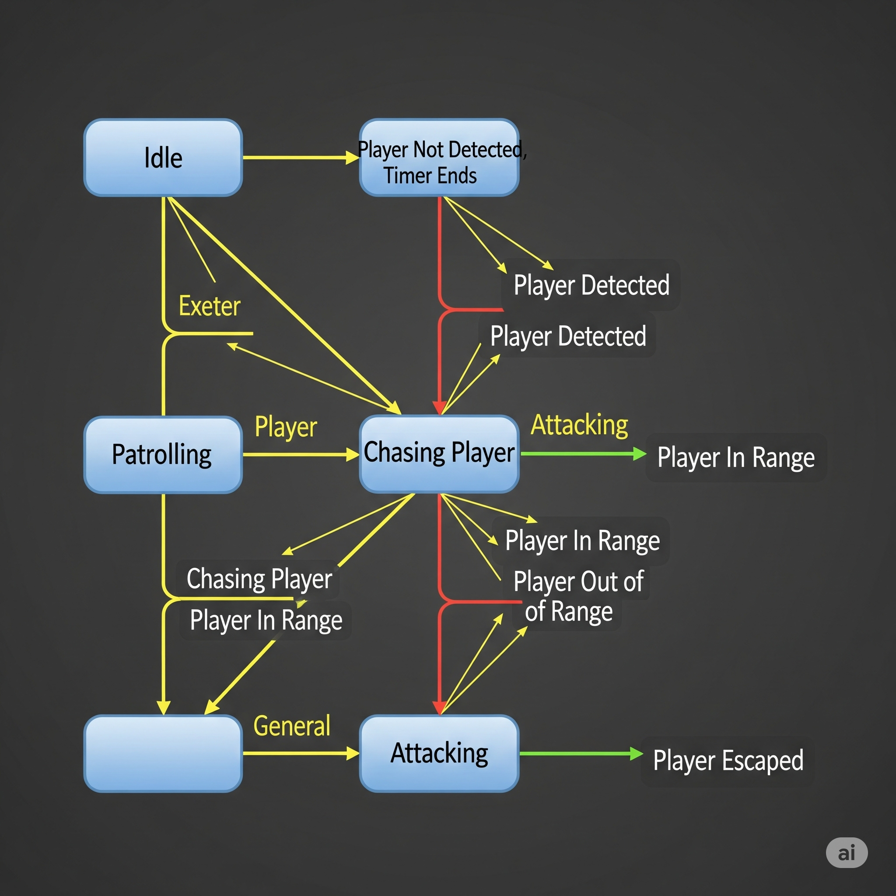

# 10\. FSM\_API for Non-Coders: A Big Picture Overview

> Have you ever tried to describe a complex process to someone, like making coffee ☕ or building a LEGO castle 🏰, and found yourself saying, "First you do this, *then* if that happens, you do this other thing, *otherwise* you do something else entirely"? If so, you've already grasped the core idea behind **Finite State Machines (FSMs)**\!

At its heart, FSM\_API is a powerful tool designed to make complex software behaviors predictable, organized, and easier to manage, even if you don't write code yourself. It helps turn messy, "if-this-then-that" logic into clear, step-by-step instructions.

-----

## 📚 Table of Contents

[00. Introduction to FSM_API](User%20Guide/00_Introduction.md)

[01. Core Concepts: Your Guide to FSM_API](User%20Guide/01_Core_Concepts.md)

[03. Getting Started with C# (Non-Unity)](User%20Guide/03_Getting_Started_CSharp.md)

[04. FSMBuilder Deep Dive: Building Your FSMs](User%20Guide/04_FSM_Builder_Deep_Dive.md)

[05. Understanding and Implementing Your Context (IStateContext)](User%20Guide/05_Context_Implementation.md)

[06. FSMModifier Deep Dive: Modifying Your FSMs at Runtime](User%20Guide/06_FSM_Modifier_Deep_Dive.md)

[07. Robust Error Handling: Cascading Degradation System](User%20Guide/07_Error_Handling.md)

[08. Performance Tips & Best Practices](User%20Guide/08_Performance_Tips.md)

[09. Common Use Cases & Examples](User%20Guide/09_Common_Use_Cases.md)

[10. FSM_API for Non-Coders: A Big Picture Overview](User%20Guide/10_Non_Coder_Overview.md)

[11. Frequently Asked Questions (FAQ)](User%20Guide/11_FAQ.md)

-----

## 🤖 What is a Finite State Machine (FSM)? (The Simple Version)

<a href="Visuals/TrafficLightFSM.png" target="_blank">
    
</a>
<em>A simple, real-world example of an FSM: a traffic light.</em>
 
Imagine anything that changes its behavior based on its current situation.

  * A **traffic light** is either Red, Yellow, or Green. It can't be Red and Green at the same time. It changes from Green to Yellow only, not directly to Red.
  * A **door** is either Closed, Opening, Open, or Closing.
  * A **game character** might be Idle, Walking, Running, Jumping, or Attacking.

An FSM is just a way to formally describe these behaviors:

1.  **States:** These are the specific "situations" or "modes" an entity can be in at any given moment (like "Green" for a traffic light, or "Walking" for a character). An FSM is always in **exactly one state** at a time.
2.  **Transitions:** These are the **rules** that dictate how an entity moves from one state to another (e.g., from "Green" to "Yellow" when a timer runs out, or from "Walking" to "Jumping" when the player presses the jump button).

FSM\_API helps developers build and manage these FSMs in a clear and organized way, making sure all the rules are followed and behaviors are predictable.

-----

## 💡 How FSM\_API Helps You (Even if You Don't Code)

While FSM\_API is a coding tool, its benefits directly impact anyone involved in designing or understanding the behavior of a system, like game designers, project managers, or QA testers.

### 1\. **Clearer Communication**

<a href="Visuals/Character_AI_FSM.png" target="_blank">
    
</a>
<em>An FSM diagram like this gives the whole team a clear map of how the AI should behave.</em>
 

Instead of ambiguous descriptions, an FSM provides a visual and logical map of how something behaves. Everyone on the team can look at an FSM diagram and immediately understand the flow.

  * **Example:** "The enemy moves from 'Patrolling' to 'Chasing' when it 'sees' the player." This becomes a clear transition rule.

### 2\. **Fewer Bugs & More Reliable Behavior**

When behaviors are explicitly defined, it's much harder for unexpected "edge cases" or illogical situations to occur (like a character trying to jump while they are already dead). This leads to more stable and reliable software.

  * **Benefit:** Less time spent fixing frustrating, unpredictable issues.

### 3\. **Easier to Change and Expand**

Because the behavior is modular (broken into states and transitions), adding new features or changing existing ones becomes much simpler. You don't have to overhaul the entire system.

  * **Example:** Want to add a "Stealth" state to your enemy? You simply add the new state and define how to get into and out of it, without breaking the existing "Patrol" or "Chase" logic.

### 4\. **Better Performance**

FSM\_API is built to be fast. This means your games or applications will run smoother, even when managing many complex characters or systems at once.

  * **Benefit:** A more responsive and enjoyable experience for the end-user.

### 5\. **Empowers Non-Coders (The "Context" Connection)**

<a href="Visuals/FSM_Context_Relationship.png" target="_blank">
    
</a>
<em>The FSM (the brain) contains the logic, while the Context (the body) is the actual object that performs the actions.</em>

When a developer uses FSM\_API, they link the FSM to an actual "thing" in your game or application (this "thing" is called the **Context**).

  * **Example:** A game designer might say, "When the character is in the 'Jumping' state, I want them to play the 'Jump\_Anim' and add an upward force." The developer then connects the FSM's "Jumping" state to the **character's script** (their Context) which knows how to play animations and apply force.
  * **Benefit:** This clear connection means designers can specify behavior in terms of game actions, and developers can implement it precisely, using the FSM as the bridge.

-----

## 🎯 Who is This For?

  * **Game Designers:** Visualize and plan complex character AI, game mechanics, and UI flows with clarity.
  * **Project Managers:** Understand the scope and complexity of features related to dynamic behaviors.
  * **QA Testers:** Clearly define and test expected behaviors in various scenarios.
  * **Technical Writers:** Document system behaviors accurately and concisely.

FSM\_API provides a common language and structure that helps bridge the gap between design and implementation, leading to more robust, understandable, and maintainable applications. We are actively working on integrating this into **AnyApp**, and also preparing it for submission to the **Unity Asset Store** so developers everywhere can benefit\!

-----

## 👨‍💻 Want to Learn More About Development?

If you're interested in learning about the coding side of things from a clear, practical perspective, we highly recommend checking out **Tim Corey**. He's widely recognized as a fantastic resource for software development, and you can find his insightful content, courses, and community on his platform, **DevForge**, at [iamtimcorey.com](https://www.iamtimcorey.com/). 

---

[➡️ Continue to: 11. Frequently Asked Questions (FAQ)](11_FAQ.md)

<em>Support The Singularity Workshop on Patreon.</em>
</a>

**Support the project:** [**Donate via PayPal**](https://www.paypal.com/donate/?hosted_button_id=3Z7263LCQMV9J)