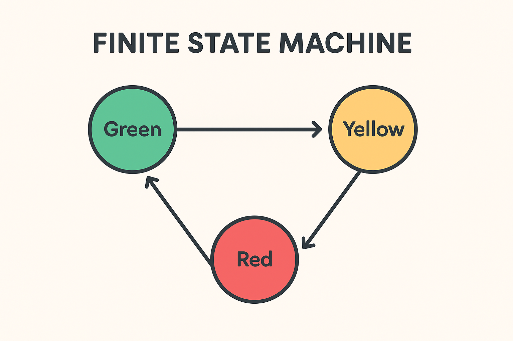

# 01. What Are Finite State Machines (FSMs)? - A Deeper Dive

> A **Finite State Machine (FSM)** is a mathematical model of computation. It is an abstract machine that can be in exactly one of a finite number of **states** at any given time. The FSM can change from one state to another in response to some inputs; the change from one state to another is called a **transition**. An FSM is defined by a list of its states, its initial state, and the conditions for each transition.

While our "Non-Coder Overview" (10. FSM_API for Non-Coders) introduced the concept simply, this document delves into the more formal and detailed understanding of what FSMs are, laying the groundwork for why they are so widely used in software development.

---

## 📚 Table of Contents (for Theory Folder)

* [01. What Are Finite State Machines (FSMs)? - A Deeper Dive](01_What_Are_FSMs.md)
* [02. Types of FSMs: Mealy, Moore, Hierarchical, and Concurrent](02_Types_Of_FSMs.md)
* [03. Advantages and Disadvantages of Using FSMs](03_Advantages_And_Disadvantages.md)
* [04. When to Use Finite State Machines](04_When_To_Use_FSMs.md)
* [05. FSM Limitations and Alternatives](05_FSM_Limitations_And_Alternatives.md)

---

## ⚛️ The Core Components of an FSM

Every Finite State Machine, regardless of its complexity, is built upon a few fundamental components:

### 1. **States**
A state represents a particular situation, condition, or mode that a system can be in.
* **Finite Number:** Crucially, there must be a defined, limited number of possible states. For example, a traffic light only has Red, Yellow, and Green.
* **Exclusive:** An FSM can only be in one state at any given moment. It cannot be in two states simultaneously.
* **Representation:** States often correspond to discrete behaviors or phases (e.g., `Idle`, `Walking`, `Attacking` for a game character; `Open`, `Closed`, `Opening` for a door).

### 2. **Transitions**
A transition is a change from one state to another.
* **Triggered by Events/Conditions:** Transitions occur in response to specific `events` (e.g., a button press, a network message received) or when certain `conditions` become true (e.g., health drops below a threshold, a timer expires).
* **Directional:** Transitions typically move in one direction (e.g., `Green` to `Yellow`, but not directly `Green` to `Red`).
* **Atomic:** A transition is an instantaneous jump from one state to the next.

### 3. **Initial State**
Every FSM must have a designated starting state. This is the state the machine enters when it is first created or initialized.

### 4. **Optional: Final/Accepting States**
While not always present in all FSM applications (especially in continuous systems like game AI), in formal automata theory, some FSMs have "final" or "accepting" states. Reaching one of these states signifies the successful completion of a process or the recognition of a valid input sequence.

---

## 🚦 A Simple Example: The Traffic Light

Let's illustrate with the classic example: a traffic light.

* **States:**
    * `Red`
    * `Green`
    * `Yellow`
* **Initial State:** Let's say it starts at `Red`.
* **Transitions:**
    * From `Red`: When a timer expires, transition to `Green`.
    * From `Green`: When a timer expires, transition to `Yellow`.
    * From `Yellow`: When a timer expires, transition to `Red`.

In this diagram:
* Circles represent **States**.
* Arrows represent **Transitions**.
* Labels on arrows represent the **Conditions/Events** that trigger the transition.

---

## 💾 Why FSMs are Powerful

The beauty of FSMs lies in their simplicity and power:

* **Clarity and Predictability:** They provide a very clear, easy-to-understand model of behavior. You can always know what the system is doing and what it *can* do next.
* **Organized Logic:** By segmenting logic into distinct states, complex behaviors become modular and manageable. Instead of one giant block of "if-else-if" statements, you have specialized logic for each state.
* **Reduced Bugs:** The strict rules for state transitions prevent illogical or impossible states, significantly reducing unexpected bugs.
* **Testability:** Each state and transition can be tested in isolation, making debugging and validation much easier.
* **Maintainability and Extensibility:** Adding new behaviors or modifying existing ones often means simply adding a new state or transition, rather than re-architecting large portions of your code.

FSM_API provides the tools to build these powerful, organized, and reliable state machines right into your C# applications, whether you're working on complex game AI, intricate UI interactions, or robust backend workflows.

---

[➡️ Continue to: 02. Types of FSMs: Mealy, Moore, Hierarchical, and Concurrent](02_Types_Of_FSMs.md)

**Support the project:** [**Donate via PayPal**](https://www.paypal.com/donate/?hosted_button_id=3Z7263LCQMV9J)