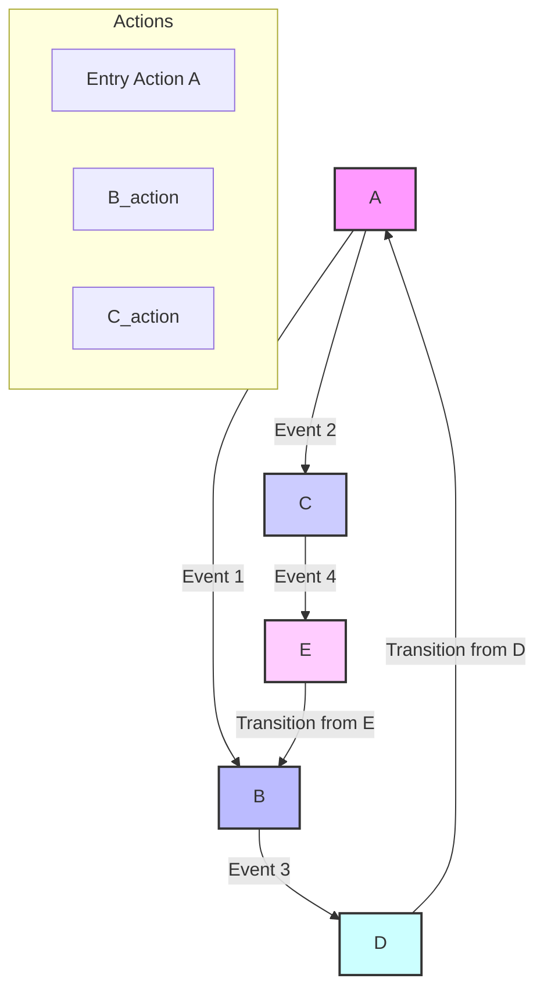
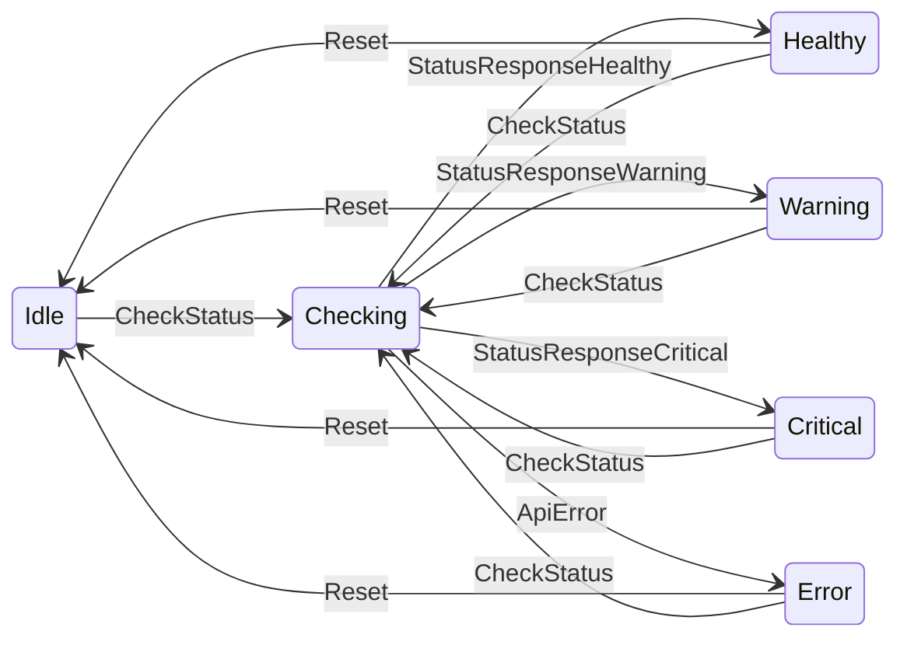
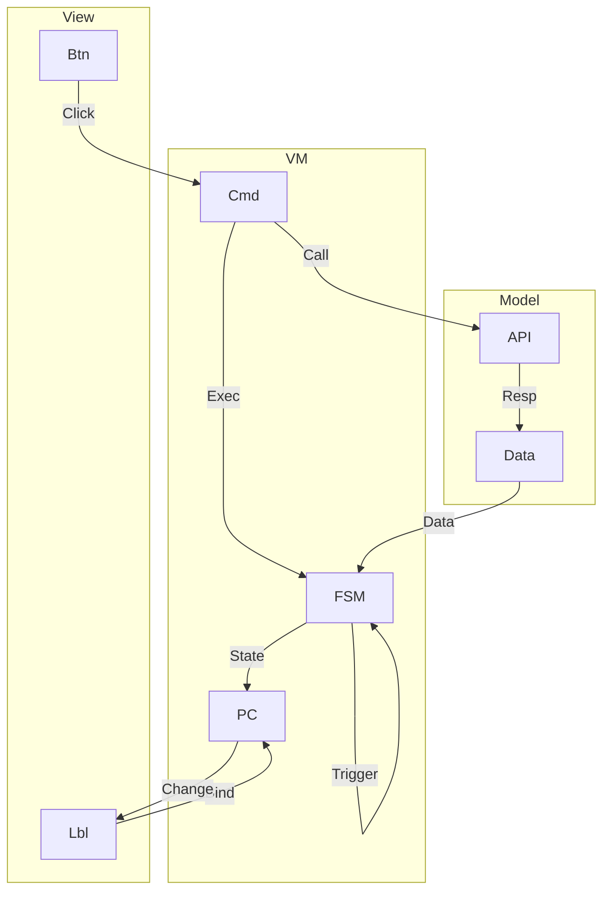

# The State-Driven WPF Application: An Architectural Guide to Integrating FSM and MVVM

## 1. Executive Summary: The Architectural Imperative

The development of modern, responsive applications, especially those with complex and changing user interfaces, requires a strategic approach that extends beyond simple code-behind logic. This report details a powerful architectural imperative: the integration of the **Finite State Machine (FSM)** pattern with the **Model-View-ViewModel (MVVM)** framework. For an application that monitors the health of a service—like a GitHub health checker—this combination provides a robust, predictable, and maintainable foundation.

While a simple application might function with ad-hoc logic, a more complex system invariably leads to what is colloquially referred to as "cognitive chaos". This uncontrolled complexity arises from scattered conditional logic and a lack of a clear, single source of truth for the application's behavioral state. The FSM pattern addresses this directly by establishing a formal model for the application's control flow, ensuring that the system is always in a well-defined state and that all transitions are explicit and valid.

The MVVM architectural pattern, a variant of the Presentation Model, provides the structural framework necessary to leverage the FSM's power within a Windows Presentation Foundation (WPF) environment. MVVM cleanly separates the application's business logic from its user interface (UI), making the application easier to test, maintain, and evolve. By designating the ViewModel as the host of the FSM, a synergistic relationship is formed: the FSM governs the application's behavior, and the ViewModel exposes this behavior and its state to the View through powerful mechanisms like data binding and commanding.

> **This report serves as a definitive guide for implementing this architecture, transforming a basic health-checker into a sophisticated, state-driven application.**

---

## 2. Understanding the Core Principles

The success of this architectural approach hinges on a deep understanding of its constituent components and their symbiotic relationship. The FSM acts as the behavioral blueprint, while MVVM provides the elegant, decoupled structure that allows the blueprint to be executed.

### 2.1. Deconstructing the Finite State Machine Pattern

A **Finite State Machine (FSM)** is an abstract, mathematical model of computation that can exist in exactly one of a finite number of states at any given time. It changes from one state to another in response to specific inputs or events. This change is called a **transition**. The fundamental components of an FSM are:

- **States:** The distinct, stable conditions the system can be in. For the GitHub health checker, examples include `Idle`, `Checking`, `Healthy`, `Warning`, and `Critical`. Each state is a complete description of the system's status at a given moment.
- **Events/Inputs:** The triggers that initiate a change of state. In our application, this could be a user clicking a "Check Status" button, or an event generated internally by a successful or failed API response.
- **Transitions:** The formal rules that define the movement from a Current State to a Next State when a specific Event occurs. Transitions are the arrows on a state diagram, defining the entire flow of the application.
- **Actions:** The operations performed during a transition or upon entering or exiting a state. Actions can be associated with states (entry action, exit action) or with transitions themselves, as in a Mealy machine.

The following diagram illustrates these core concepts of a Finite State Machine:

> **Note:** It is essential to distinguish the FSM (a conceptual model) from the State Design Pattern (a specific implementation strategy). The FSM focuses on high-level control flow, defining states and transitions, often visualized through a state diagram or table. The State Design Pattern, conversely, is a behavioral pattern that encapsulates state-specific behavior into separate classes. For a single, well-defined process like a health check, a single FSM object within the ViewModel is often sufficient to manage transitions, with state-specific behavior handled by the FSM's actions. This hybrid approach leverages the clarity of the FSM model without over-engineering the implementation with a full State Design Pattern.

The FSM serves as a formal, self-documenting contract for the application's behavior. A developer inspecting the FSM's definition can immediately and unambiguously understand the application's behavioral logic. This model prevents invalid or unexpected state changes, as the FSM's `CanFire` method can explicitly reject a transition if the current state does not permit it. This predictability and enforced rigidity are crucial for building a scalable and bug-free system.

### 2.2. The MVVM Architectural Pattern in Practice

**MVVM** is a software design pattern specifically optimized to leverage the core capabilities of WPF, such as data binding and commanding. It separates an application into three distinct components, promoting a clean separation of concerns:

- **Model:** Encapsulates the application's business logic and data. In the context of a health checker, the Model would contain the low-level code responsible for performing the HTTP requests to the GitHub API and processing the raw response data. The Model is completely independent of the UI.
- **View:** The user interface itself, defined in XAML. The View's sole responsibility is to display a representation of the data and receive user input. It should contain no business logic and relies entirely on the ViewModel for its data and behavioral control.
- **ViewModel:** The "brain" of the MVVM pattern. It acts as a mediator between the View and the Model, exposing data from the Model in a format that the View can easily consume and presenting a set of commands for the View to trigger. The ViewModel does not hold a reference to the View, ensuring it remains decoupled and highly testable.

The synergy between the ViewModel and the View is powered by WPF's built-in features:

- **Data binding:** Automatically synchronizes data between a View control's properties and the ViewModel's properties, eliminating the need for manual, boilerplate synchronization code.
- **Commanding:** Abstracts user actions like button clicks into objects that implement the `ICommand` interface, allowing the View to trigger actions in the ViewModel without a direct dependency.

For this automatic synchronization to function, the ViewModel must notify the View whenever one of its properties changes. This is achieved by implementing the `INotifyPropertyChanged` interface. This interface defines a single event, `PropertyChanged`, which is raised by a property's setter whenever its value is updated. It is considered best practice to raise this event only when the new value differs from the old value to prevent unnecessary UI updates and to use the `nameof` keyword for compile-time safety. The `INotifyPropertyChanged` mechanism is fundamental to achieving a responsive and efficient MVVM architecture.

---

## 3. Modeling the GitHub Health Checker as an FSM

The first and most critical step in integrating an FSM is to formally define the application's behavior. This process involves identifying all possible states and mapping the events that cause transitions between them. This modeling phase creates a blueprint that will guide the entire implementation.

### 3.1. Defining the Application's States

The GitHub health checker's behavior can be precisely defined by a finite set of states:

- **Idle:** The initial state of the application. The UI button for checking the status is enabled, and no checks are in progress.
- **Checking:** An intermediate, transient state. Entered when the user initiates a health check, and it lasts for the duration of the API call. The UI should indicate that a process is running (e.g., with a progress bar or spinner) and disable the status button to prevent concurrent checks.
- **Healthy:** A final, stable state reached when the API response indicates that all services are fully operational (e.g., a "green" status). The UI should reflect this with a green indicator.
- **Warning:** A final, stable state reached when the API response indicates a non-critical issue (e.g., a "yellow" status). The UI should reflect this with a yellow indicator.
- **Critical:** A final, stable state reached when the API response indicates a major outage or a critical failure (e.g., a "red" status). The UI should reflect this with a red indicator.
- **Error:** This state is distinct from Critical and is entered when an application-level error occurs, such as a network connectivity failure during the API call. The FSM must be able to handle such unexpected issues and transition to a well-defined state.

### 3.2. Identifying Inputs and Events

The transitions between these states are triggered by specific events. These events serve as the inputs to our FSM:

- **CheckStatus:** Triggered by the user when they click the button to initiate a health check.
- **StatusResponseHealthy:** Triggered internally when the API call completes with a healthy status.
- **StatusResponseWarning:** Triggered internally when the API call completes with a warning status.
- **StatusResponseCritical:** Triggered internally when the API call completes with a critical status.
- **ApiError:** Triggered internally when the API call fails due to a network or server error.
- **Reset:** A potential event triggered by a user action to return the application to the Idle state.

### 3.3. Visualizing the FSM Flow

A state diagram provides a clear visualization of this flow. The application begins in the `Idle` state. When the `CheckStatus` event is fired, it transitions to the `Checking` state. From `Checking`, the application can transition to one of four states based on the API response: `Healthy`, `Warning`, `Critical`, or `Error`. Each of these final states can transition back to the `Idle` state via a `Reset` event, or can be re-evaluated by another `CheckStatus` event.

This state diagram, rendered using Mermaid, provides a visual blueprint of the application's behavior:

The FSM state transition table provides a formal, tabular representation of this diagram, serving as a direct blueprint for the logic. It documents every possible transition, ensuring that no state combination is left unaccounted for and that every input results in a predictable change of state.

#### Table 1: FSM State Transition Table

| Current State | Input/Event           | Next State | Associated Actions                                      |
|-------------- |----------------------|------------|--------------------------------------------------------|
| Idle          | CheckStatus          | Checking   | Disable button; show progress; initiate API call.      |
| Checking      | StatusResponseHealthy| Healthy    | Hide progress; enable button; update UI status to green.|
| Checking      | StatusResponseWarning| Warning    | Hide progress; enable button; update UI status to yellow.|
| Checking      | StatusResponseCritical| Critical  | Hide progress; enable button; update UI status to red. |
| Checking      | ApiError             | Error      | Hide progress; enable button; update UI status to red; display error message. |
| Healthy       | CheckStatus          | Checking   | Disable button; show progress; initiate API call.      |
| Healthy       | Reset                | Idle       | Clear UI status; enable button.                        |
| Warning       | CheckStatus          | Checking   | Disable button; show progress; initiate API call.      |
| Warning       | Reset                | Idle       | Clear UI status; enable button.                        |
| Critical      | CheckStatus          | Checking   | Disable button; show progress; initiate API call.      |
| Critical      | Reset                | Idle       | Clear UI status; enable button.                        |
| Error         | CheckStatus          | Checking   | Disable button; show progress; initiate API call.      |
| Error         | Reset                | Idle       | Clear UI status; enable button.                        |

---

## 4. Integrating the FSM Layer into the MVVM Framework

With the FSM's behavior formally defined, the next step is to integrate it seamlessly into the application's MVVM structure. The ViewModel serves as the FSM's host, bridging the gap between the abstract state model and the concrete UI.

### 4.1. The FSM as the Heart of the ViewModel

The ViewModel is the logical place to instantiate and manage the FSM. This approach encapsulates the state management logic within the application's "brain" and keeps it from being exposed directly to the View. The ViewModel will hold a private instance of the FSM and manage its transitions in response to user commands and API events. This ensures that the FSM's state is the single source of truth for the application's behavior.

The following diagram provides a high-level view of how these architectural components work together:

### 4.2. Exposing State to the View

The View must react to changes in the FSM's state without knowing about the FSM itself. The ViewModel accomplishes this by exposing public properties that reflect the FSM's current status. For example, the FSM's `CurrentState` can be a private field, while the ViewModel exposes properties like `IsCheckingStatus` (a boolean) or `CurrentStatusColor` (a value for a brush). These properties must implement `INotifyPropertyChanged` to notify the View when their values change, causing the UI to automatically update. For instance, when the FSM transitions to the `Checking` state, the ViewModel's `IsCheckingStatus` property's setter would be called, which in turn raises the `PropertyChanged` event, signaling the UI to update a bound progress bar's visibility.

### 4.3. The Critical Link: Commanding and State-Awareness

The most elegant and powerful aspect of this integration lies in how user commands are linked to FSM transitions. The WPF `ICommand` interface, typically exposed on a ViewModel, contains an `Execute` method for performing an action and a `CanExecute` method for determining if the command can currently be executed. This aligns perfectly with the FSM's core logic. The `ICommand.CanExecute` method can be bound directly to the FSM's `CanFire(trigger)` method.

This mechanism creates an `ICommand` that acts as an "input gate" for the FSM. If the FSM's current state is `Checking`, its rules can dictate that the `CheckStatus` trigger cannot be fired. Consequently, the command's `CanExecute` method will return false, and any UI element bound to it—like a button—will be automatically disabled by the WPF framework. This simple yet powerful declarative binding eliminates the need for any manual UI state management, preventing race conditions and ensuring the application's behavior is always consistent with its current state.

#### Table 2: ViewModel-to-View Bindings

| View Control     | ViewModel Property   | Binding Mode | Purpose                                                        |
|------------------|---------------------|--------------|----------------------------------------------------------------|
| StatusButton     | CheckStatusCommand  | OneWay       | Executes the health check command when clicked. CanExecute controls button state. |
| StatusButton     | CurrentStatusColor  | OneWay       | Changes the button's background color based on the status (Green, Yellow, Red). |
| StatusText       | StatusMessage       | OneWay       | Displays the current status message (e.g., "All Systems Operational"). |
| ProgressSpinner  | IsCheckingStatus    | OneWay       | Controls the visibility of a progress spinner during a check.   |
| MainGrid         | DataContext         | N/A          | Sets the data context of the main view to an instance of the MainViewModel. |

---

## 5. Mastering Asynchronous Operations with the FSM

A critical requirement for any modern UI application is responsiveness. A synchronous API call, such as a health check, will block the main UI thread, causing the application to "freeze" until the operation is complete. This is unacceptable for a good user experience. The C# `async/await` pattern provides the definitive solution.

### 5.1. The async/await Pattern and UI Responsiveness

The `async/await` pattern is C#'s language-level implementation of the Task-based Asynchronous Pattern (TAP). It provides a non-blocking way to perform I/O-bound operations. When a method with the `await` keyword is called, the C# compiler transforms the method into a state machine behind the scenes. This compiler-generated state machine suspends execution and yields control back to the caller (in this case, the UI thread) until the awaited task completes. When the task is finished, the method resumes execution from where it left off. This elegant abstraction allows developers to write sequential-looking code while reaping the benefits of asynchronous execution, all without blocking the UI.

### 5.2. Implementing an Asynchronous FSM Transition

Integrating `async/await` into the FSM architecture requires careful coordination. The process is as follows:

1. **Command Execution:** The user clicks the "Check Status" button, which is bound to a `CheckStatusCommand`. This command's `Execute` method, an async method, is invoked.
2. **Transition to Checking:** The first action of the `Execute` method is to fire the `CheckStatus` trigger on the FSM. This immediately transitions the FSM to the `Checking` state. The UI, notified by the ViewModel's `INotifyPropertyChanged` events, updates instantly—the button is disabled, and the progress spinner appears.
3. **Asynchronous API Call:** The ViewModel then initiates the API call as an asynchronous operation, for example, `await apiClient.GetStatusAsync()`. At this point, the compiler's state machine takes over. Control is yielded back to the UI thread, which remains fully responsive to user input. The application's FSM remains in the `Checking` state, preventing any new `CheckStatus` commands from being executed. This explicit `Checking` state is crucial for handling the "in-between" period of a long-running operation. Without it, the application would be in an undefined state, susceptible to race conditions and unexpected behavior if a user were to click the button again.
4. **Completion and Final Transition:** When the API call task completes, the `await` expression resolves. The `Execute` method resumes, and the ViewModel evaluates the result of the API call. Based on the outcome, it fires a new FSM trigger—`StatusResponseHealthy`, `StatusResponseWarning`, etc.—to transition the FSM to its final, stable state. The UI automatically updates to reflect the new state.

### 5.3. Robust Asynchronous Error Handling

A robust application must handle unexpected failures, such as a network timeout or a server-side error. This is managed by wrapping the asynchronous API call in a `try/catch` block. If an exception is caught, the ViewModel fires the `ApiError` trigger on the FSM. The FSM's rules, as defined in Table 1, then transition the application to the `Error` state, ensuring that even a catastrophic failure results in a well-defined and predictable state. The FSM's ability to handle this explicit `ApiError` transition ensures the application's behavior remains consistent and recoverable.

---

## 6. Implementation and Best Practices

Building a state-driven WPF application requires a structured project setup and adherence to MVVM conventions.

### 6.1. Project Setup and Structure

A standard MVVM project structure separates concerns into logical folders:

- **Models:** Contains classes that represent the application's data and business logic (e.g., `GitHubStatus.cs`, `GitHubApiClient.cs`).
- **ViewModels:** Contains the ViewModel classes (e.g., `MainViewModel.cs`) that act as the interface between the Model and View.
- **Views:** Contains the XAML files that define the user interface (e.g., `MainWindow.xaml`).
- **Fsm:** A dedicated folder for the FSM class itself, promoting reusability and clarity.

### 6.2. Code Walkthrough

The FSM can be a simple C# class that uses an enum for states and a switch statement to handle transitions. The `MainViewModel` will instantiate this FSM and expose the `CheckStatusCommand` as an `ICommand`. The `MainWindow.xaml` will contain the button and status indicators, with all their properties bound to the `MainViewModel`.

The visual representation of the application's state is crucial. This can be achieved using WPF's DataTriggers in XAML. A DataTrigger can be defined to change the background color of the status button based on the value of a bound ViewModel property, such as `CurrentStatusColor`. This declarative approach ensures the UI is always a direct and accurate reflection of the FSM's state, without any code-behind logic.

### 6.3. The Testability Advantage

A significant advantage of this architecture is testability. Because the ViewModel and the FSM are decoupled from the UI, they are plain C# classes that can be unit tested without a UI framework. A comprehensive suite of unit tests can be written to verify every FSM transition, ensuring that the application's core logic for status management is sound and bug-free, regardless of how the UI is implemented or changed later.

---

## 7. Advanced Architectural Considerations

While a simple FSM is sufficient for a basic health checker, more complex applications can benefit from advanced concepts.

### 7.1. Beyond Simple States

For applications with multiple, nested processes, a **Hierarchical State Machine** can be a more suitable model. In this pattern, states can have substates, which inherit the behaviors of their parent state. This reduces complexity and duplication. For example, a `Critical` state could have substates like `NetworkDown` and `ServiceUnavailable`, which both inherit the core `Critical` behavior but handle specific recovery logic independently.

### 7.2. Dependency Injection

As the application grows, managing the creation and dependencies of various objects—like the ViewModel and the API client—can become complex. A dependency injection (DI) container, such as Unity or MEF, can simplify this process. By registering the dependencies with the container, the application can automatically provide the required objects, further decoupling components and making the system easier to test and extend.

---

## 8. Conclusion

The integration of the Finite State Machine and Model-View-ViewModel patterns provides a robust, scalable, and maintainable architectural foundation for your WPF application. The analysis in this report demonstrates that this is not an instance of "overkill" for a simple UI, but rather a necessary investment in creating a predictable and reliable system.

By formally defining the application's states and transitions, the FSM provides a clear behavioral contract that enforces logical consistency and prevents unexpected issues. The ViewModel, serving as the FSM's host, leverages WPF's powerful data binding and commanding features to present this state to the View without any direct dependencies. The elegant binding of the `ICommand`'s `CanExecute` method to the FSM's `CanFire` method provides a centralized and foolproof mechanism for managing UI availability based on the application's current state. Finally, the strategic use of `async/await` ensures that all I/O operations are non-blocking, preserving UI responsiveness while the FSM manages the crucial `Checking` state.

This architectural approach transforms your vision of an "FSM driven application" into a tangible, well-structured reality. The resulting system is not only functional but also highly testable, easily extensible, and prepared for future features, fulfilling the promise of building a truly unique and robust application.

---

## Works Cited

- Patterns - WPF Apps With The Model-View-ViewModel Design Pattern | Microsoft Learn, accessed September 10, 2025, https://learn.microsoft.com/en-us/archive/msdn-magazine/2009/february/patterns-wpf-apps-with-the-model-view-viewmodel-design-pattern
- Finite State Machine - Oracle Help Center, accessed September 10, 2025, https://docs.oracle.com/en/industries/communications/session-border-controller/8.4.0/fipscompliance/finite-state-machine-acme-packet-1100-and-acme-packet-3900.html
- Model–view–viewmodel - Wikipedia, accessed September 10, 2025, https://en.wikipedia.org/wiki/Model%E2%80%93view%E2%80%93viewmodel
- Model-View-ViewModel (MVVM) - Microsoft Learn, accessed September 10, 2025, https://learn.microsoft.com/en-us/dotnet/architecture/maui/mvvm
- Implementing the MVVM Pattern in C# - Symphony Solutions, accessed September 10, 2025, https://symphony-solutions.com/insights/implementing-mvvm-pattern
- Implementing the MVVM Pattern Using the Prism Library for WPF, accessed September 10, 2025, https://prismlibrary.github.io/docs/wpf/legacy/Implementing-MVVM.html
- Finite-state machine - Wikipedia, accessed September 10, 2025, https://en.wikipedia.org/wiki/Finite-state_machine
- What is a state machine? - itemis AG, accessed September 10, 2025, https://www.itemis.com/en/products/itemis-create/documentation/user-guide/overview_what_are_state_machines
- Finite State Machine Explained - freeCodeCamp, accessed September 10, 2025, https://www.freecodecamp.org/news/finite-state-machines/
- The Super State Design Pattern, accessed September 10, 2025, https://medium.com/nerd-for-tech/the-super-state-design-pattern-166127ce7c9a
- State in C# / Design Patterns - Refactoring.Guru, accessed September 10, 2025, https://refactoring.guru/design-patterns/state/csharp/example
- MVVM - WPF Commanding with the State Machine Pattern ..., accessed September 10, 2025, https://learn.microsoft.com/en-us/archive/msdn-magazine/2014/november/mvvm-wpf-commanding-with-the-state-machine-pattern
- MVVM In C# .NET - DEV Community, accessed September 10, 2025, https://dev.to/mossi4476/mvvm-in-c-net-24a6
- INotifyPropertyChanged Interface (System.ComponentModel) | Microsoft Learn, accessed September 10, 2025, https://learn.microsoft.com/en-us/dotnet/api/system.componentmodel.inotifypropertychanged?view=net-9.0
- 4 Ways to Implement INotifyPropertyChanged - PostSharp Blog, accessed September 10, 2025, https://blog.postsharp.net/inotifypropertychanged
- Master INotifyPropertyChanged for Maintainable WPF Code - MoldStud, accessed September 10, 2025, https://moldstud.com/articles/p-building-maintainable-wpf-applications-mastering-inotifypropertychanged-for-better-code
- How can I properly asynchronously call async method in WPF context? : r/csharp - Reddit, accessed September 10, 2025, https://www.reddit.com/r/csharp/comments/1i5ktpc/how_can_i_properly_asynchronously_call_async/
- Explain INotifyPropertyChanged In WPF - MVVM - C# Corner, accessed September 10, 2025, https://www.c-sharpcorner.com/article/explain-inotifypropertychanged-in-wpf-mvvm/
- Asynchronous programming - C# | Microsoft Learn, accessed September 10, 2025, https://learn.microsoft.com/en-us/dotnet/csharp/asynchronous-programming/
- Asynchronous programming scenarios - C# | Microsoft Learn, accessed September 10, 2025, https://learn.microsoft.com/en-us/dotnet/csharp/asynchronous-programming/async-scenarios
- How to run and interact with an async Task from a WPF gui - Stack Overflow, accessed September 10, 2025, https://stackoverflow.com/questions/27089263/how-to-run-and-interact-with-an-async-task-from-a-wpf-gui
- What the state is in a state machine that has async transition - Stack Overflow, accessed September 10, 2025, https://stackoverflow.com/questions/48727844/what-the-state-is-in-a-state-machine-that-has-async-transition
- Creating a basic WPF Client with MVVM - Carmenta, accessed September 10, 2025, https://carmenta.com/developer-blog/creating-a-basic-wpf-client-with-mvvm
