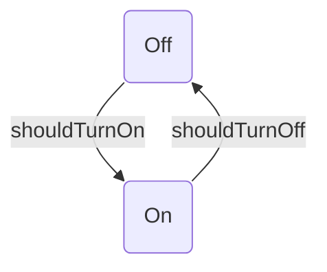
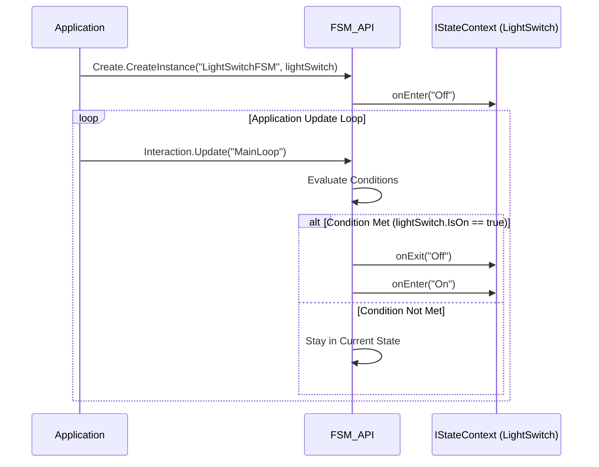

FSM_API

[](https://opensource.org/licenses/MIT)
[](https://www.nuget.org/packages/TheSingularityWorkshop.FSM_API)
[](https://www.nuget.org/packages/TheSingularityWorkshop.FSM_API)

[](https://github.com/TrentBest/FSM_API/actions?query=workflow%3A%22dotnet.yml%22+branch%3Amaster)
[](https://github.com/TrentBest/FSM_API/commits/master)
[](https://github.com/TrentBest/FSM_API/actions?query=workflow%3A%22dotnet.yml%22+branch%3Amaster)
[](https://snyk.io/test/github/TrentBest/FSM_API)

[](https://github.com/TrentBest/FSM_API/stargazers)
[](https://github.com/TrentBest/FSM_API/graphs/contributors)
[](https://github.com/TrentBest/FSM_API/issues)

[ Join the CoderLegion Community](https://coderlegion.com/user/The+Singularity+Workshop)

Blazing-fast, software-agnostic Finite State Machine system for any C# application.

🔍 Overview

FSM_API is a modular, runtime-safe, and fully event-aware Finite State Machine (FSM) 
system designed to plug directly into any C# application from enterprise software to 
games, simulations, robotics, or reactive systems. It provides a powerful and decoupled
approach to managing complex state-driven logic, ensuring clarity, consistency, and 
control across diverse domains.

    ✅ Thread-safe operations (main thread only, deferred mutation handling)

    🧠 Decoupled state logic from data (POCO-friendly)

    🏗️ Define once, instantiate many

    🛠️ Error-tolerant FSM lifecycle management

    🧪 Dynamic update ticking with frame/process throttling

No external dependencies. No frameworks required. No boilerplate setup. Pure C# power for your 
application's core logic.


💡 Why FSM_API?


Traditional FSM systems often suffer from tight coupling to specific environments or force rigid 
coding patterns. FSM_API liberates your state management:

| Feature                           | FSM_API ✅ | Traditional FSM ❌ |
|----------------------------------|------------|--------------------|
| Framework agnostic                | ✅         | ❌                 |
| Runtime-modifiable definitions    | ✅         | ❌                 |
| Deferred mutation safety          | ✅         | ❌                 |
| Named FSMs & Processing Groups    | ✅         | ❌                 |
| Built-in diagnostics & thresholds| ✅         | ❌                 |
| Pure C# with no external deps     | ✅         | ❌                 |

🚀 Quickstart

A simple FSM is often best understood visually. For example, our `LightSwitchFSM` has two states, `Off` and `On`, and can only transition between them.

Here is what the FSM looks like:


Here is how the FSM interacts with your application:



To implement this FSM yourself, follow these steps:

1.  Define a simple context (your data model):
    C\\#

<!-- end list -->

```csharp
public class LightSwitch : IStateContext
{
    public bool IsOn = false;
    public bool IsValid => true; // FSM API will not operate on this if IsValid is false.
    public string Name { get; set; } = "KitchenLight";
}
```

2.  Define and build your FSM:
    C\\#

<!-- end list -->

```csharp
// Optional: Create a named processing group for organizing FSM updates
FSM_API.CreateProcessingGroup("MainLoop");

// Define a simple condition function
private static bool CheckUserInput(IStateContext ctx)
{
    // A simplified example of checking for input
    // In a real app, this would check for a key press or a UI event
    return ((LightSwitch)ctx).IsOn; // This is a placeholder
}

FSM_API.Create.CreateFiniteStateMachine("LightSwitchFSM", processRate: 1, processingGroup: "MainLoop")
    .State("Off", 
        onEnter: (ctx) => { 
            if (ctx is LightSwitch l) l.IsOn = false; 
        }, 
        onUpdate: null, 
        onExit: null)
    .State("On", 
        onEnter: (ctx) => { 
            if (ctx is LightSwitch l) l.IsOn = true; 
        }, 
        onUpdate: null, 
        onExit: null)
    .WithInitialState("Off") // Must set an initial state
    // Now define the transitions between states
    .Transition("Off", "On", (ctx) => ((LightSwitch)ctx).IsOn)
    .Transition("On", "Off", (ctx) => !((LightSwitch)ctx).IsOn)
    .BuildDefinition(); // Finalize the FSM definition
```

3.  Create an instance for your context:
    C\\#

<!-- end list -->

```csharp
var kitchenLight = new LightSwitch();
// Associate your context with an FSM instance and assign it to a processing group
var handle = FSM_API.Create.CreateInstance("LightSwitchFSM", kitchenLight, "MainLoop");
```

4.  Tick the FSM from your application's main loop:
    C\\#

<!-- end list -->

```csharp
// Process all FSMs in the "MainLoop" group
FSM_API.Interaction.Update("MainLoop");
```

🔧 Core Concepts

    FSMBuilder: Fluently define states, transitions, and associated OnEnter/OnExit actions.
    This is your declarative interface for FSM construction.

    FSMHandle: Represents a runtime instance of an FSM operating on a specific context.
    Provides full control over instance lifecycle, including pausing, resetting, and
    retrieving current state.

    IStateContext: The interface your custom data models (Plain Old C\\# Objects - POCOs)
    must implement. This ensures clean separation of FSM logic from your application's data.

    Processing Groups: Organize and control the update cycles of multiple FSM instances. Ideal
    for managing FSMs that need to tick together or at different rates (e.g., UI, AI, physics).
     If you were to use the API across multiple threads you would need to ensure context isn't
     accessed across different process groups, each process group will itself be sequential...  

    Error Handling: Built-in thresholds and diagnostics prevent runaway logic or invalid state
     contexts, ensuring application stability without crashing.

    Thread-Safe by Design: All modifications to FSM definitions and instances are meticulously
    deferred and processed safely on the main thread post-update, eliminating common concurrency
     issues.

## 📦 Features at a Glance

| Capability                       | Description                                                                                                                                                                                                                                                                                                                                                                                                       |
| :------------------------------ | :---------------------------------------------------------------------------------------------------------------------------------------------------------------------------------------------------------------------------------------------------------------------------------------------------------------------------------------------------------------------------------------------------------------- |
| 🔄 **Deterministic State Logic** | Effortlessly define **predictable state changes** based on **dynamic conditions** or **explicit triggers**, ensuring your application's behavior is consistent and, where applicable, **mathematically provable**. Ideal for complex workflows and reliable automation. |
| 🎭 **Context-Driven Behavior** | Your FSM logic directly operates on **any custom C\\# object (POCO)** that implements `IStateContext`. This enables **clean separation of concerns** (logic vs. data) and allows domain experts (e.g., BIM specifiers) to define behavior patterns that developers then implement. |
| 🧪 **Flexible Update Control** | Choose how FSMs are processed: **event-driven**, **tick-based** (every N frames), or **manual**. This adaptability means it's perfect for **real-time systems, background processes, or even complex user interactions** within your application's loop. |
| 🧯 **Robust Error Escalation** | Benefit from **per-instance and per-definition error tracking**, providing immediate insights to prevent runaway logic or invalid states **without crashing your application**. Critical for long-running services and mission-critical software. |
| 🔁 **Runtime Redefinition** | Adapt your application on the fly! FSM definitions can be **redefined while actively running**, enabling **dynamic updates, live patching, and extreme behavioral variation** without recompilation or downtime. Perfect for highly configurable systems. |
| 🎯 **Lightweight & Performant** | Engineered for **minimal memory allocations** and **optimized performance**, ensuring your FSMs are efficient even in demanding enterprise or simulation scenarios. No overhead, just pure C# power. |
| ✅ **Easy to Unit Test** | The inherent **decoupling of FSM logic from context data** ensures your state machines are **highly testable in isolation**, leading to more robust and reliable code with simplified unit testing. |
| 💯 **Mathematically Provable** | With clearly defined states and transitions, the FSM architecture lends itself to **formal verification and rigorous analysis**, providing a strong foundation for high-assurance systems where correctness is paramount. |
| 🤝 **Collaborative Design** | FSMs provide a **visual and structured way to define complex behaviors**, fostering better communication between developers, designers, and domain experts, and enabling less code-savvy individuals to contribute to core logic definitions. |
| 🎮 Unity Integration Available | Now preparing for submission to the Unity Asset Store. |

---

## Performance and Benchmarks

FSM_API performance claims are backed by a companion executable benchmark project:

**[FSM_API_Benchmark](https://github.com/TrentBest/FSM_API_Benchmark)**

The benchmark asks a practical question: **what does a real FSM update cost, and how does that cost change as processing groups increase?**

### Recorded baseline

The September 2026 benchmark run measured the multi-group update workload:

| Active process groups | Mean | Allocated |
|---:|---:|---:|
| 1 | **305.1 ns** | **360 B** |
| 10 | **3,115.7 ns** | **3,600 B** |
| 50 | **15,736.6 ns** | **18,000 B** |

For this particular workload, the measured cost grows approximately linearly across the tested range.

That is a **baseline observation**, not a universal complexity guarantee. It describes the implementation, workload, runtime, and environment represented by the benchmark.

### What is actually being measured?

Two benchmark classes make the experiment easy to inspect:

- `FSM_StringPerformanceBaseline` — one real FSM update tick.
- `FSM_StringGroupIterationBenchmark` — updates 1, 10, and 50 named processing groups.

Look for BenchmarkDotNet's `[Benchmark]` attributes to find the operations that are actually timed, and `[Params]` to find the workload dimension being varied.

The benchmark is deliberately not a synthetic claim that "strings are slow." It measures the current string-backed implementation so that future lookup changes can be compared against observed behavior.

### Why record allocation too?

Time and allocation measure different costs.

The recorded 50-group operation uses **15,736.6 ns** and **18,000 B** in the benchmark workload. The allocation number is evidence about that measured operation; it is not a promise that an application updating 50 groups will allocate exactly 18 KB per frame.

### Follow the evidence

If you want to verify the number rather than simply trust the README:

1. Open the [benchmark repository](https://github.com/TrentBest/FSM_API_Benchmark).
2. Find the benchmark class.
3. Find the `[Benchmark]` method.
4. Inspect its `[Params]` and `[GlobalSetup]`.
5. Run it in Release configuration.
6. Compare the BenchmarkDotNet output with the recorded baseline.

The package claim should always have a path back to the experiment.

For the full methodology and interpretation, see **[Documentation/Benchmarking.md](Documentation/Benchmarking.md)**.

## 🔬 Internal Architecture (Advanced)

For academic interest or advanced debugging, the `FSM_API.Internal` namespace exposes the engine's core machinery. 

> **Warning:** These methods are intended for internal use. Direct modification may bypass safety checks.

### Core Components
* **FsmBucket**: The atomic container holding an FSM Definition (`FSM`) and its active Instances (`List<FSMHandle>`).
* **TickAll(group)**: The heart of the system. It iterates `FsmBucket`s, respects `ProcessRate`, and executes the logic cycle.
* **Deferred Modifications**: To ensure thread safety on the main loop, structural changes (like destroying an FSM) are queued and executed only *after* the tick cycle completes.

### Tick Cycle Logic
A single tick performs at most one "Enter", one "Update", and one "Exit" operation to ensure deterministic execution time.

1. **Enter (If Needed)**: If the instance is new to its current state, `OnEnter` is executed and the `HasEntered` flag is set.
2. **Update**: The `OnUpdate` action of the `CurrentState` is executed.
3. **Evaluate & Transition**: Transitions attached to the `CurrentState` are evaluated.
    * If a condition is met:
        1. `OnExit` (current state) is executed.
        2. `CurrentState` is updated to the **Target State**.
        3. `HasEntered` is reset to `false`.
    * **Note:** The `OnEnter` logic for the *new* state will not execute until the **next tick**.

---

🤝 Contributing

Contributions welcome! Whether you're integrating FSM_API into your enterprise application,
designing new extensions, or just fixing typos, PRs and issues are appreciated.

📄 License

MIT License. Use it, hack it, build amazing things with it.

---

## 🔗 Resources & Support

### 📦 Get FSM_API

- **Unity Asset Store:** [FSM_API for Unity](https://assetstore.unity.com/packages/slug/332450)
- **NuGet:** [TheSingularityWorkshop.FSM_API](https://www.nuget.org/packages/TheSingularityWorkshop.FSM_API)
- **Source Code:** [GitHub Repository](https://github.com/TrentBest/FSM_API)

### 💖 Support The Singularity Workshop

- **Patreon:** [Support us on Patreon](https://www.patreon.com/c/TheSingularityWorkshop)
- **PayPal:** [Make a donation](https://www.paypal.com/donate/?hosted_button_id=3Z7263LCQMV9J)

<p align="center">
  <a href="https://github.com/TrentBest/FSM_API">
    
  </a>
</p>

<p align="center">
  <em>The Singularity Workshop — Tools for the curious, the bold, and the systemically inclined.</em><br>
  <strong>Because state shouldn't be a mess.</strong>
</p>


---

## 🔗 The Singularity Workshop

This project is part of a deliberately troublesome ecosystem:

- **[FSM_API](https://github.com/TrentBest/FSM_API)** — behavior and state.
- **[FSM_COS](https://github.com/TrentBest/TheSingularityWorkshop.FSM_COS)** — composition and runtime assembly.
- **[FSM_Serialization](https://github.com/TrentBest/TheSingularityWorkshop.FSM_Serialization)** — representation and the byte boundary.
- **[WebPage](https://github.com/TrentBest/WebPage)** — browser manifestation and proving ground.
- **[FSM_API_Unity](https://github.com/TrentBest/FSM_API_Unity)** — Unity manifestation.

<p align="center"><em>The Singularity Workshop — Tools for the curious, the bold, and the systemically inclined.</em><br><strong>Because state shouldn't be a mess.</strong><br><em>And because static boundaries are invitations to cause trouble.</em></p>
